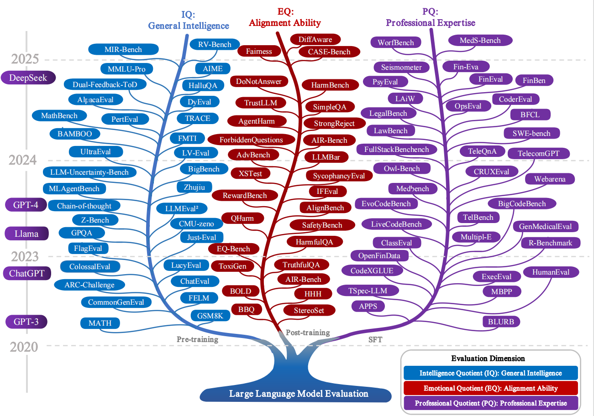

<div align="center">
    <h1>Awesome LLM Eval</h1>
    <a href="https://awesome.re"></a>
</div>

[English](README_EN.md) | [中文](README_CN.md)


Awesome-LLM-Eval: a curated list of tools, datasets/benchmark, demos, leaderboard, papers, docs and models, mainly for Evaluation on Large Language Models and exploring the boundaries and limits of Generative AI.



## Table of Contents

- [News](#News)
- [Tools](#Tools)
- [Datasets / Benchmark](#Datasets-or-Benchmark)
  - [General](#General)
  - [Domain](#Domain)
  - [RAG-Evaluation](#RAG-Evaluation)
  - [Agent-Capabilities](#Agent-Capabilities)
  - [Coding-Capabilities](#Coding-Capabilities)
  - [Multimodal/Cross-modal](#Multimodal-Cross-modal)
  - [Long-Context](#Long-Context)
  - [Inference-Speed](#Inference-Speed)
  - [Quantization-and-Compression](#Quantization-and-Compression)
- [Demos](#Demos)
- [Leaderboards](#Leaderboards)
- [Papers](#Papers)
- [LLM-List](#LLM-List)
  - [Pre-trained LLM](#Pre-trained-LLM)
  - [Instruction Fine-tuned LLM](#Instruction-finetuned-LLM)
  - [Aligned LLM](#Aligned-LLM)
  - [Open LLM](#Open-LLM)
  - [Popular LLM](#Popular-LLM)
- [LLMOps](#LLMOps)
- [Frameworks for Training](#Frameworks-for-Training)
- [Courses](#Courses)
- [Others](#Others)
- [Other Awesome Lists](#Other-Awesome-Lists)
- [Licenses](#Licenses)
- [Citation](#Citation)


## News

- [2025/08/20] We added the [Anthropomorphic-Taxonomy](#Anthropomorphic-Taxonomy) section.
- [2024/04/26] We added the [Inference-Speed](#Inference-Speed) section.
- [2024/02/26] We added the [Coding-Evaluation](#Coding-Capabilities) section.
- [2024/02/08] We added the [lighteval](https://github.com/huggingface/lighteval) tool from Huggingface.
- [2024/01/15] We added [CRUXEval](https://arxiv.org/abs/2401.03065), [DebugBench](https://github.com/thunlp/DebugBench), [OpenFinData](https://opencompass.org.cn), and [LAiW](https://github.com/Dai-shen/LAiW).
- [2023/12/20] We added the [RAG-Evaluation](#RAG-Evaluation) section.
- [2023/11/15] We added [Instruction-Following-Evaluation](https://github.com/google-research/google-research/tree/master/instruction_following_eval) and [LLMBar](https://github.com/princeton-nlp/LLMBar) for evaluating the instruction following capabilities of LLMs.
- [2023/10/20] We added [SuperCLUE-Agent](https://github.com/CLUEbenchmark/SuperCLUE-Agent) for LLM agent evaluation.
- [2023/09/25] We added [ColossalEval](https://github.com/hpcaitech/ColossalAI/tree/main/applications/ColossalEval) from Colossal-AI.
- [2023/09/22] We added the [LeaderboardFinder](#Leaderboards) chapter.
- [2023/09/20] We added [DeepEval](https://github.com/mr-gpt/deepeval), [FinEval](https://github.com/SUFE-AIFLM-Lab/FinEval), and [SuperCLUE-Safety](https://github.com/CLUEbenchmark/SuperCLUE-Safety) from CLUEbenchmark.
- [2023/09/18] We added [OpenCompass](https://github.com/InternLM/opencompass/tree/main) from Shanghai AI Lab.
- [2023/08/03] We added new Chinese LLMs: [Baichuan](https://github.com/baichuan-inc/Baichuan-13B) and [Qwen](https://github.com/QwenLM/Qwen-7B).
- [2023/06/28] We added [AlpacaEval](https://github.com/tatsu-lab/alpaca_eval) and multiple tools.
- [2023/04/26] We released the V0.1 evaluation list with multiple benchmarks.


## Anthropomorphic-Taxonomy

### Typical Intelligence Quotient (IQ)-General Intelligence evaluation benchmarks

| Name                  | Year | Task Type              | Institution         | Evaluation Focus                              | Datasets       | Url                                                          |
| --------------------- | ---- | ---------------------- | ------------------- | --------------------------------------------- | -------------- | ------------------------------------------------------------ |
| MMLU-Pro              | 2024 | Multi-Choice Knowledge | TIGER-AI-Lab        | Subtle Reasoning, Fewer Noise                 | MMLU-Pro       | [link](https://github.com/TIGER-AI-Lab/MMLU-Pro )            |
| DyVal                 | 2024 | Dynamic Evaluation     | Microsoft           | Data Pollution, Complexity Control            | DyVal          | [link](https://github.com/microsoft/promptbench )            |
| PertEval              | 2024 | General                | USTC                | Knowledge capacity                            | PertEval       | [link](https://github.com/aigc-apps/PertEval )               |
| LV-Eval               | 2024 | Long Text QA           | Infinigence-AI      | Length Variability, Factuality                | 11 Subsets     | [link](https://github.com/infinigence/LVEval )               |
| LLM-Uncertainty-Bench | 2024 | NLP Tasks              | Tencent             | Uncertainty Quantification                    | 5 NLP Tasks    | [link](https://github.com/smartyfh/LLM-Uncertainty-Bench )   |
| CommonGen-Eval        | 2024 | Generation             | AI2                 | Common Sense                                  | CommonGen-lite | [link](https://github.com/allenai/CommonGen-Eval )           |
| MathBench             | 2024 | Math                   | Shanghai AI Lab     | Theoretical and practical problem-solving     | Various        | [link](https://github.com/open-compass/MathBench )           |
| AIME                  | 2024 | Math                   | MAA                 | American Invitational Mathematics Examination | Various        | [link](https://www.kaggle.com/datasets/hemishveeraboina/aime-problem-set-1983-2024 ) |
| FrontierMath          | 2024 | Math                   | Epoch AI            | Original, challenging mathematics problems    | Various        | [link](https://epochai.org/files/sample_question_transcripts.zip ) |
| FELM                  | 2023 | Factuality             | HKUST               | Factuality                                    | 847 Questions  | [link](https://github.com/hkust-nlp/felm )                   |
| Just-Eval-Instruct    | 2023 | General                | AI2 Mosaic          | Helpfulness, Explainability                   | Various        | [link](https://github.com/Re-Align/just-eval )               |
| MLAgentBench          | 2023 | ML Research            | snap-stanford       | End-to-End ML Tasks                           | 15 Tasks       | [link](https://github.com/snap-stanford/MLAgentBench )       |
| UltraEval             | 2023 | General                | OpenBMB             | Lightweight, Flexible, Fast                   | Various        | [link](https://github.com/OpenBMB/UltraEval )                |
| FMTI                  | 2023 | Transparency           | Stanford            | Model Transparency                            | 100 Metrics    | [link](https://crfm.stanford.edu/fmti/ )                     |
| BAMBOO                | 2023 | Long Text              | RUCAIBox            | Long Text Modeling                            | 10 Datasets    | [link](https://github.com/RUCAIBox/BAMBOO )                  |
| TRACE                 | 2023 | Continuous Learning    | Fudan University    | Continuous Learning                           | 8 Datasets     | [link](https://arxiv.org/abs/2310.06762 )                    |
| ColossalEval          | 2023 | General                | Colossal-AI         | Unified Evaluation                            | Various        | [link](https://github.com/hpcaitech/ColossalAI/tree/main/applications/ColossalEval ) |
| LLMEval²              | 2023 | General                | AlibabaResearch     | Wide and Deep Evaluation                      | 2,553 Samples  | [link](https://github.com/AlibabaResearch/DAMO-ConvAI/tree/main/WideDeep ) |
| BigBench              | 2023 | General                | Google              | knowledge, language, reasoning                | Various        | [link](https://github.com/google/BIG-bench )                 |
| LucyEval              | 2023 | General                | Oracle              | Maturity Assessment                           | Various        | [link](http://lucyeval.besteasy.com/ )                       |
| Zhujiu                | 2023 | General                | IACAS               | Comprehensive Evaluation                      | 51 Tasks       | [link](http://www.zhujiu-benchmark.com )                     |
| ChatEval              | 2023 | Chat                   | THU-NLP             | Human-like Evaluation                         | Various        | [link](https://github.com/thunlp/ChatEval )                  |
| FlagEval              | 2023 | General                | THU                 | Subjective and Objective Scoring              | Various        | [link](https://flageval.baai.ac.cn/ )                        |
| AlpacaEval            | 2023 | General                | tatsu-lab           | Automatic Evaluation                          | Various        | [link](https://tatsu-lab.github.io/alpaca_eval/ )            |
| GPQA                  | 2023 | General                | NYU                 | Graduate-Level Google-Proof QA                | Various        | [link](https://github.com/idavidrein/gpqa )                  |
| MuSR                  | 2023 | Reasoning              | Zayne Sprague       | Narrative-Based Reasoning                     | 756            | [link](https://github.com/Zayne-sprague/MuSR )               |
| FreshQA               | 2023 | Knowledge              | FreshLLMs           | Current World Knowledge                       | 599            | [link](https://github.com/freshllms/freshqa )                |
| AGIEval               | 2023 | General                | Microsoft           | Human-Centric Reasoning                       | NA             | [link](https://github.com/ruixiangcui/AGIEval )              |
| SummEdits             | 2023 | General                | Salesforce          | Inconsistency Detection                       | 6,348          | [link](https://github.com/salesforce/factualNLG )            |
| ScienceQA             | 2022 | Reasoning              | UCLA                | Science Reasoning                             | 21,208         | [link](https://github.com/lupantech/ScienceQA )              |
| e-CARE                | 2022 | Reasoning              | HIT                 | Explainable Causality                         | 21,000         | [link](https://github.com/Waste-Wood/e-CARE )                |
| BigBench Hard         | 2022 | Reasoning              | BigBench            | Challenging Subtasks                          | 6,500          | [link](https://github.com/suzgunmirac/BIG-Bench-Hard )       |
| PlanBench             | 2022 | Reasoning              | ASU                 | Action Planning                               | 11,113         | [link](https://github.com/karthikv792/LLMs-Planning )        |
| MGSM                  | 2022 | Math                   | Google              | Grade-school math problems in 10 languages    | Various        | [link](https://github.com/google-research/url-nlp/tree/main/mgsm ) |
| MATH                  | 2021 | Math                   | UC Berkeley         | Mathematical Problem Solving                  | Various        | [link](https://github.com/hendrycks/math/ )                  |
| GSM8K                 | 2021 | Math                   | OpenAI              | Diverse grade school math word problems       | Various        | [link](https://github.com/openai/grade-school-math )         |
| SVAMP                 | 2021 | Math                   | Microsoft           | Arithmetic Reasoning                          | 1,000          | [link](https://github.com/arkilpatel/SVAMP )                 |
| SpartQA               | 2021 | Reasoning              | MSU                 | Textual Spatial QA                            | 510            | [link](https://github.com/HLR/SpartQA-baselines )            |
| MLSUM                 | 2020 | General                | Thomas Scialom      | News Summarization                            | 535,062        | [link](https://github.com/ThomasScialom/MLSUM )              |
| Natural Questions     | 2019 | Language, Reasoning    | Google              | Search-Based QA                               | 300,000        | [link](https://github.com/google-research-datasets/natural-questions ) |
| ANLI                  | 2019 | Language, Reasoning    | Facebook AI         | Adversarial Reasoning                         | 169,265        | [link](https://github.com/facebookresearch/anli )            |
| BoolQ                 | 2019 | Language, Reasoning    | Google              | Binary QA                                     | 16,000         | [link](https://github.com/google-research-datasets/boolean-questions ) |
| SuperGLUE             | 2019 | Language, Reasoning    | NYU                 | Advanced GLUE Tasks                           | NA             | [link](https://github.com/nyu-mll/jiant )                    |
| DROP                  | 2019 | Language, Reasoning    | UCI NLP             | Paragraph-Level Reasoning                     | 96,000         | [link](https://github.com/EleutherAI/lm-evaluation-harness ) |
| HellaSwag             | 2019 | Language, Reasoning    | AI2                 | Commonsense Inference                         | 59,950         | [link](https://github.com/rowanz/hellaswag )                 |
| Winogrande            | 2019 | Language, Reasoning    | AI2                 | Pronoun Disambiguation                        | 44,000         | [link](https://github.com/allenai/winogrande )               |
| PIQA                  | 2019 | Language, Reasoning    | AI2                 | Physical Interaction QA                       | 18,000         | [link](https://github.com/ybisk/ybisk.github.io/tree/master/piqa ) |
| HotpotQA              | 2018 | Language, Reasoning    | HotpotQA            | Explainable QA                                | 113,000        | [link](https://github.com/hotpotqa/hotpot )                  |
| GLUE                  | 2018 | Language, Reasoning    | NYU                 | Foundational NLU Tasks                        | NA             | [link](https://github.com/nyu-mll/GLUE-baselines )           |
| OpenBookQA            | 2018 | Language, Reasoning    | AI2                 | Open Book Exams                               | 12,000         | [link](https://github.com/allenai/OpenBookQA )               |
| SQuAD2.0              | 2018 | Language, Reasoning    | Stanford University | Unanswerable Questions                        | 150,000        | [link](https://rajpurkar.github.io/SQuAD-explorer/ )         |
| ARC                   | 2018 | Language, Reasoning    | AI2                 | AI2 Reasoning Challenge                       | 7,787          | [link](https://github.com/allenai/aristo-leaderboard )       |
| SWAG                  | 2018 | Language, Reasoning    | AI2                 | Adversarial Commonsense                       | 113,000        | [link](https://github.com/rowanz/swagaf )                    |
| CommonsenseQA         | 2018 | Language, Reasoning    | AI2                 | Commonsense Reasoning                         | 12,102         | [link](https://github.com/jonathanherzig/commonsenseqa )     |
| RACE                  | 2017 | Language, Reasoning    | CMU                 | Exam-Style QA                                 | 100,000        | [link](https://www.cs.cmu.edu/~glai1/data/race/ )            |
| SciQ                  | 2017 | Language, Reasoning    | AI2                 | Crowd-Sourced Science                         | 13,700         | [link](https://huggingface.co/datasets/allenai/sciq )        |
| TriviaQA              | 2017 | Language, Reasoning    | AI2                 | Distant Supervision                           | 650,000        | [link](https://github.com/mandarjoshi90/triviaqa )           |
| MultiNLI              | 2017 | Language, Reasoning    | NYU                 | Cross-Genre Entailment                        | 433,000        | [link](https://github.com/nyu-mll/multiNLI )                 |
| SQuAD                 | 2016 | Language, Reasoning    | Stanford University | Wikipedia-Based QA                            | 100,000        | [link](https://rajpurkar.github.io/SQuAD-explorer/ )         |
| LAMBADA               | 2016 | Language, Reasoning    | CIMEC               | Discourse Context                             | 12,684         | [link](https://huggingface.co/datasets/cimec/lambada )       |
| MS MARCO              | 2016 | Language, Reasoning    | Microsoft           | Search-Based QA                               | 1,112,939      | [link](https://microsoft.github.io/msmarco/ )                |


### Typical Professional Quotient (PQ)-Professional Expertise evaluation benchmarks

| Domain     | Name                  | Institution              | Scope of Tasks                                         | Unique Contributions                                         | Url                                                          |
| ---------- | --------------------- | ------------------------ | ------------------------------------------------------ | ------------------------------------------------------------ | ------------------------------------------------------------ |
|            | BLURB                 | Mindrank AI              | Six diverse NLP tasks, thirteen datasets               | A macro-average score across all tasks                       | [link](https://microsoft.github.io/BLURB/index.html )        |
|            | Seismometer           | Epic                     | Using local data and workflows                         | patient demographics, clinical interventions, and outcomes   | [link](https://github.com/epic-open-source/seismometer )     |
| Healthcare | Medbench              | OpenMEDLab               | Emphasizes scientific rigor and fairness               | 40,041 questions from medical exams and reports              | [link](https://github.com/open-compass/opencompass/tree/main/opencompass/datasets/medbench/ ) |
|            | GenMedicalEval        | E                        | 16 majors, 3 training stages, 6 clinical scenarios     | Open-ended metrics and automated assessment models           | [link](https://github.com/MediaBrain-SJTU/GenMedicalEval )   |
|            | PsyEval               | SJTU                     | Six subtasks covering three dimensions                 | Customized benchmark for mental health LLMs                  | [link](https://arxiv.org/abs/2311.09189 )                    |
|            | Fin-Eva               | Ant Group                | Wealth management, insurance, investment research      | Both industrial and academic financial evaluations           | [link](https://github.com/alipay/financial_evaluation_dataset ) |
| Finance    | FinEval               | SUFE-AIFLM-Lab           | Multiple-choice QA on finance, economics, accounting   | Focuses on high-quality evaluation questions                 | [link](https://github.com/SUFE-AIFLM-Lab/FinEval )           |
|            | OpenFinData           | Shanghai AI Lab          | Multi-scenario financial tasks                         | First comprehensive finance evaluation dataset               | [link](https://opencompass.org.cn )                          |
|            | FinBen                | FinAI                    | 35 datasets across 23 financial tasks                  | Inductive reasoning, quantitative reasoning                  | [link](https://github.com/The-FinAI/PIXIU )                  |
|            | LAiW                  | Sichuan University       | 13 fundamental legal NLP tasks                         | Divides legal NLP capabilities into three major abilities    | [link](https://github.com/Dai-shen/LAiW )                    |
| Legal      | LawBench              | Nanjing University       | Legal entity recognition, reading comprehension        | Real-world tasks, "abstention rate" metric                   | [link](https://github.com/open-compass/lawbench )            |
|            | LegalBench            | Stanford University      | 162 tasks covering six types of legal reasoning        | Enables interdisciplinary conversations                      | [link](https://github.com/HazyResearch/legalbench/ )         |
|            | LexEval               | Tsinghua University      | Legal cognitive abilities to organize different tasks  | Larger legal evaluation dataset, examining the ethical issues | [link](https://github.com/CSHaitao/LexEval )                 |
|            | SPEC5G                | Purdue University        | Security-related text classification and summarization | 5G protocol analysis automation                              | [link](https://github.com/Imtiazkarimik23/SPEC5G )           |
| Telecom    | TeleQnA               | Huawei(Paris)            | General telecom inquiries                              | Proficiency in telecom-related questions                     | [link](https://github.com/netop-team/TeleQnA )               |
|            | OpsEval               | Tsinghua University      | Wired network ops, 5G, database ops                    | Focus on AIOps, evaluates proficiency                        | [link](https://arxiv.org/abs/2310.07637 )                    |
|            | TelBench              | SK Telecom               | Math modeling, open-ended QA, code generation          | Holistic evaluation in telecom                               | [link](https://arxiv.org/abs/2407.09424v1 )                  |
|            | TelecomGPT            | UAE                      | Telecom Math Modeling, Open QnA and Code Tasks         | Holistic evaluation in telecom                               | [link](https://arxiv.org/abs/2407.09424v1 )                  |
|            | Linguistic            | Queen's University       | Multiple language-centric tasks                        | zero-shot evaluation                                         | [link](https://arxiv.org/abs/2402.15818 )                    |
|            | TelcoLM               | Orange                   | Multiple-choice questionnaires                         | Domain-specific data (800M tokens, 80K instructions)         | [link](https://arxiv.org/abs/2412.15891 )                    |
|            | ORAN-Bench-13K        | GMU                      | Multiple-choice questions                              | Open Radio Access Networks (O-RAN)                           | [link](https://github.com/prnshv/ORAN-Bench-13K )            |
|            | Open-Telco Benchmarks | GSMA                     | Multiple language-centric tasks                        | zero-shot evaluation                                         | [link](https://www.gsma.com/get-involved/gsma-foundry/gsma-open-telco-llm-benchmarks/ ) |
|            | FullStackBench        | ByteDance                | Code writing, debugging, code review                   | Featuring the most recent Stack Overflow QA                  | [link](https://github.com/bytedance/FullStackBench )         |
| Coding     | StackEval             | Prosus AI                | 11 real-world scenarios, 16 languages                  | Evaluation across diverse & practical coding environments    | [link](https://github.com/ProsusAI/stack-eval )              |
|            | CodeBenchGen          | Various Institutions     | Execution-based code generation tasks                  | Benchmarks scaling with the size and complexity              | [link](https://arxiv.org/abs/2404.00566 )                    |
|            | HumanEval             | University of Washington | Rigorous testing                                       | Stricter protocol for assessing correctness of generated code | [link](https://arxiv.org/abs/2107.03374 )                    |
|            | APPS                  | University of California | Coding challenges from competitive platforms           | Checking problem-solving of generated code on test cases     | [link](https://github.com/hendrycks/apps )                   |
|            | MBPP                  | Google Research          | Programming problems sourced from various origins      | Diverse programming tasks                                    | [link](https://github.com/google-research/google-research/tree/master/mbpp ) |
|            | ClassEval             | Tsinghua University      | Class-level code generation                            | Manually crafted, object-oriented programming concepts       | [link](https://github.com/FudanSELab/ClassEval )             |
|            | CoderEval             | Peking University        | Pragmatic code generation                              | Proficiency to generate functional code patches for described issues | [link](https://github.com/CoderEval/CoderEval )              |
|            | MultiPL-E             | Princeton University     | Neural code generation                                 | Benchmarking neural code generation models                   | [link](https://github.com/nuprl/MultiPL-E )                  |
|            | CodeXGLUE             | Microsoft                | Code intelligence                                      | Wide tasks covering: code-code, text-code, code-text and text-text | [link](https://github.com/microsoft/CodeXGLUE )              |
|            | EvoCodeBench          | Peking University        | Evolving code generation benchmark                     | Aligned with real-world code repositories, evolving over time | [link](https://github.com/seketeam/EvoCodeBench )            |


### Typical Emotional Quotient (EQ)-Alignment Ability evaluation benchmarks

| Name | Year | Task Type | Institution | Category | Datasets | Url |
| --- | --- | --- | --- | --- | --- | --- |
| DiffAware | 2025 | Bias | Stanford | General Bias | 8 datasets | [link](https://github.com/Angelina-Wang/difference_awareness ) |
| CASE-Bench | 2025 | Safety | Cambridge | Context-Aware Safety | CASE-Bench | [link](https://github.com/BriansIDP/CASEBench ) |
| Fairness | 2025 | Fairness | PSU | Distributive Fairness | - | - |
| HarmBench | 2024 | Safety | UIUC | Adversarial Behaviors | 510 | [link](https://github.com/centerforaisafety/HarmBench ) |
| SimpleQA | 2024 | Safety | OpenAI | Factuality | 4,326 | [link](https://github.com/openai/simple-evals ) |
| AgentHarm | 2024 | Safety | BEIS | Malicious Agent Tasks | 110 | [link](https://github.com/UKGovernmentBEIS/inspect_evals ) |
| StrongReject | 2024 | Safety | dsbowen | Attack Resistance | n/a | [link](https://github.com/dsbowen/strong_reject ) |
| LLMBar | 2024 | Instruction | Princeton | Instruction Following | 419 Instances | [link](https://github.com/princeton-nlp/LLMBar ) |
| AIR-Bench | 2024 | Safety | Stanford | Regulatory Alignment | 5,694 | [link](https://github.com/stanford-crfm/air-bench-2024 ) |
| TrustLLM | 2024 | General | TrustLLM | Trustworthiness | 30+ | [link](https://trustllmbenchmark.github.io/TrustLLM-Website/ ) |
| RewardBench | 2024 | Alignment | AIAI | Human preference | RewardBench | [link](https://github.com/allenai/reward-bench ) |
| EQ-Bench | 2024 | Emotion | Paech | Emotional intelligence | 171 Questions | [link](https://github.com/EQ-bench/EQ-Bench ) |
| Forbidden | 2023 | Safety | CISPA | Jailbreak Detection | 15,140 | [link](https://github.com/verazuo/jailbreak_llms ) |
| MaliciousInstruct | 2023 | Safety | Princeton | Malicious Intentions | 100 | [link](https://github.com/Princeton-SysML/Jailbreak_LLM ) |
| SycophancyEval | 2023 | Safety | Anthropic | Opinion Alignment | n/a | [link](https://github.com/meg-tong/sycophancy-eval ) |
| DecodingTrust | 2023 | Safety | UIUC | Trustworthiness | 243,877 | [link](https://github.com/AI-secure/DecodingTrust ) |
| AdvBench | 2023 | Safety | CMU | Adversarial Attacks | 1,000 | [link](https://github.com/llm-attacks/llm-attacks ) |
| XSTest | 2023 | Safety | Bocconi | Safety Overreach | 450 | [link](https://github.com/paul-rottger/exaggerated-safety ) |
| OpinionQA | 2023 | Safety | tatsu-lab | Demographic Alignment | 1,498 | [link](https://github.com/tatsu-lab/opinions_qa ) |
| SafetyBench | 2023 | Safety | THU | Content Safety | 11,435 | [link](https://github.com/thu-coai/SafetyBench ) |
| HarmfulQA | 2023 | Safety | declare-lab | Harmful Topics | 1,960 | [link](https://github.com/declare-lab/red-instruct ) |
| QHarm | 2023 | Safety | vinid | Safety Sampling | 100 | [link](https://github.com/vinid/safety-tuned-llamas ) |
| BeaverTails | 2023 | Safety | PKU | Red Teaming | 334,000 | [link](https://github.com/PKU-Alignment/beavertails ) |
| DoNotAnswer | 2023 | Safety | Libr-AI | Safety Mechanisms | 939 | [link](https://github.com/Libr-AI/do-not-answer ) |
| AlignBench | 2023 | Alignment | THUDM | Alignment, Reliability | Various | [link](https://github.com/THUDM/AlignBench ) |
| IFEval | 2023 | Instruction | Google | Instruction Following | 500 Prompts | [link](https://github.com/google-research/google-research/tree/master/instruction_following_eval ) |
| ToxiGen | 2022 | Safety | Microsoft | Toxicity Detection | 274,000 | [link](https://github.com/microsoft/TOXIGEN ) |
| HHH | 2022 | Safety | Anthropic | Human Preferences | 44,849 | [link](https://github.com/anthropics/hh-rlhf ) |
| RedTeam | 2022 | Safety | Anthropic | Red Teaming | 38,921 | [link](https://github.com/anthropics/hh-rlhf ) |
| BOLD | 2021 | Bias | Amazon | Bias in Generation | 23,679 | [link](https://github.com/amazon-science/bold ) |
| BBQ | 2021 | Bias | NYU | Social Bias | 58,492 | [link](https://github.com/nyu-mll/BBQ ) |
| StereoSet | 2020 | Bias | McGill | Stereotype Detection | 4,229 | [link](https://github.com/moinnadeem/StereoSet ) |
| ETHICS | 2020 | Ethics | Berkeley | Moral Judgement | 134,400 | [link](https://github.com/hendrycks/ethics ) |
| ToxicityPrompt | 2020 | Safety | AllenAI | Toxicity Assessment | 99,442 | [link](https://github.com/allenai/real-toxicity-prompts ) |
| CrowS-Pairs | 2020 | Bias | NYU | Stereotype Measurement | 1,508 | [link](https://github.com/nyu-mll/crows-pairs ) |
| SEAT | 2019 | Bias | Princeton | Encoder Bias | n/a | [link](https://github.com/W4ngatang/sent-bias ) |
| WinoGender | 2018 | Bias | UMass | Gender Bias | 720 | [link](https://github.com/rudinger/winogender-schemas ) |

## Tools

|       Name        |  Organization   |                           Website                            |                         Description                          |
| :---------------: | :-------------: | :----------------------------------------------------------: | :----------------------------------------------------------: |
|  prometheus-eval  | prometheus-eval | [prometheus-eval](https://github.com/prometheus-eval/prometheus-eval) | PROMETHEUS Open Evaluation Dedicated Language Model, which is more powerful than its predecessor. It can closely imitate the judgments of humans and GPT-4. Additionally, it can handle both direct evaluation and pairwise ranking formats, and can be used with user-defined evaluation criteria. On four direct evaluation benchmarks and four pairwise ranking benchmarks, PROMETHEUS 2 achieves the highest correlation and consistency with human evaluators and proprietary language models among all tested open-source evaluation language models (2024-05-04). |
|   athina-evals    |    athina-ai    |    [athina-ai](https://github.com/athina-ai/athina-evals)    | Athina-ai is an open-source library that provides plug-and-play preset evaluations and a modular, extensible framework for writing and running evaluations. It helps engineers systematically improve the reliability and performance of their large language models through evaluation-driven development. Athina-ai offers a system for evaluation-driven development, overcoming the limitations of traditional workflows, enabling rapid experimentation, and providing customizable evaluators with consistent metrics. |
| LeaderboardFinder |   Huggingface   | [LeaderboardFinder](https://huggingface.co/spaces/leaderboards/LeaderboardFinder) | LeaderboardFinder helps you find suitable leaderboards for specific scenarios, a leaderboard of leaderboards (2024-04-02). |
|     LightEval     |   Huggingface   |    [lighteval](https://github.com/huggingface/lighteval)     | LightEval is a lightweight framework developed by Hugging Face for evaluating large language models (LLMs). Originally designed as an internal tool for assessing Hugging Face's recently released LLM data processing library datatrove and LLM training library nanotron, it is now open-sourced for community use and improvement. Key features of LightEval include: (1) lightweight design, making it easy to use and integrate; (2) an evaluation suite supporting multiple tasks and models; (3) compatibility with evaluation on CPUs or GPUs, and integration with Hugging Face's acceleration library (Accelerate) and frameworks like Nanotron; (4) support for distributed evaluation, which is particularly useful for evaluating large models; (5) applicability to all benchmarks on the Open LLM Leaderboard; and (6) customizability, allowing users to add new metrics and tasks to meet specific evaluation needs (2024-02-08). |
|  LLM Comparator   |     Google      |    [LLM Comparator](https://arxiv.org/html/2402.10524v1)     | A visual analytical tool for comparing and evaluating large language models (LLMs). Compared to traditional human evaluation methods, this tool offers a scalable automated approach to comparative evaluation. It leverages another LLM as an evaluator to demonstrate quality differences between models and provide reasons for these differences. Through interactive tables and summary visualizations, the LLM Comparator helps users understand why models perform well or poorly in specific contexts, as well as the qualitative differences between model responses. Developed in collaboration with Google researchers and engineers, this tool has been widely used internally at Google, attracting over 400 users and evaluating more than 1,000 experiments within three months (2024-02-16).|
|   Arthur Bench    |    Arthur-AI    |      [Arthur Bench](https://github.com/arthur-ai/bench)      | Arthur Bench is an open-source evaluation tool designed to compare and analyze the performance of large language models (LLMs). It supports various evaluation tasks, including question answering, summarization, translation, and code generation, and provides detailed reports on LLM performance across these tasks. Key features and advantages of Arthur Bench include: (1) model comparison, enabling the evaluation of different suppliers, versions, and training datasets of LLMs; (2) prompt and hyperparameter evaluation, assessing the impact of different prompts on LLM performance and testing the control of model behavior through various hyperparameter settings; (3) task definition and model selection, allowing users to define specific evaluation tasks and select evaluation targets from a range of supported LLM models; (4) parameter configuration, enabling users to adjust prompts and hyperparameters to finely control LLM behavior; (5) automated evaluation workflows, simplifying the execution of evaluation tasks; and (6) application scenarios such as model selection and validation, budget and privacy optimization, and the transformation of academic benchmarks into real-world performance evaluations. Additionally, it offers comprehensive scoring metrics, supports both local and cloud versions, and encourages community collaboration and project development (2023-10-06). |
| llm-benchmarker-suite | FormulaMonks | [llm-benchmarker-suite](https://github.com/FormulaMonks/llm-benchmarker-suite) | This open-source initiative aims to address fragmentation and ambiguity in LLM benchmarking. The suite provides a structured methodology, a collection of diverse benchmarks, and toolkits to streamline the assessment of LLM performance. By offering a common platform, this project seeks to promote collaboration, transparency, and high-quality research in NLP. |
| autoevals | braintrust | [autoevals](https://github.com/braintrustdata/autoevals) | AutoEvals is an AI model output evaluation tool that leverages best practices to quickly and easily assess AI model outputs. It integrates multiple automatic evaluation methods, supports customizable evaluation prompts and custom scorers, and simplifies the evaluation process of model outputs. Autoevals incorporates model-graded evaluation for various subjective tasks, including fact-checking, safety, and more. Many of these evaluations are adapted from OpenAI's excellent evals project but are implemented in a flexible way to allow users to tweak prompts and debug outputs. |
| EVAL | OPENAI | [EVAL](https://github.com/openai/evals) | EVAL is a tool developed by OpenAI for evaluating large language models (LLMs). It can test the performance and generalization capabilities of models across different tasks and datasets. |
| lm-evaluation-harness | EleutherAI | [lm-evaluation-harness](https://github.com/EleutherAI/lm-evaluation-harness) | lm-evaluation-harness is a tool developed by EleutherAI for evaluating large language models (LLMs). It can test the performance and generalization capabilities of models across different tasks and datasets. |
| lm-evaluation | AI21Labs | [lm-evaluation](https://github.com/AI21Labs/lm-evaluation) | Evaluations and reproducing the results from the Jurassic-1 Technical [Paper](https://www.ai21.com/blog/announcing-ai21-studio-and-jurassic-1), with current support for running tasks via both the AI21 Studio API and OpenAI's GPT-3 API. |
| OpenCompass | Shanghai AI Lab | [OpenCompass](https://github.com/InternLM/opencompass/tree/main) | OpenCompass is a one-stop platform for evaluating large models. Its main features include: open-source and reproducible evaluation schemes; comprehensive capability dimensions covering five major areas with over 50 datasets and approximately 300,000 questions to assess model capabilities; support for over 20 Hugging Face and API models; distributed and efficient evaluation with one-line task splitting and distributed evaluation, enabling full evaluation of trillion-parameter models within hours; diverse evaluation paradigms supporting zero-shot, few-shot, and chain-of-thought evaluations with standard or conversational prompt templates to easily elicit peak model performance. |
| Large language model evaluation and workflow framework from Phase AI | wgryc | [phasellm](https://github.com/wgryc/phasellm) | A framework provided by Phase AI for evaluating and managing LLMs, helping users select appropriate models, datasets, and metrics, as well as visualize and analyze results. |
| Evaluation benchmark for LLM | FreedomIntelligence | [LLMZoo](https://github.com/FreedomIntelligence/LLMZoo) | LLMZoo is an evaluation benchmark for LLMs developed by FreedomIntelligence, featuring multiple domain and task datasets, metrics, and pre-trained models with results. |
| Holistic Evaluation of Language Models (HELM) | Stanford | [HELM](https://github.com/stanford-crfm/helm) | HELM is a comprehensive evaluation method for LLMs proposed by the Stanford research team, considering multiple aspects such as model language ability, knowledge, reasoning, fairness, and safety. |
| A lightweight evaluation tool for question-answering | Langchain | [auto-evaluator](https://github.com/rlancemartin/auto-evaluator) | auto-evaluator is a lightweight tool developed by Langchain for evaluating question-answering systems. It can automatically generate questions and answers and calculate metrics such as model accuracy, recall, and F1 score. |
| PandaLM | WeOpenML | [PandaLM](https://github.com/WeOpenML/PandaLM) | PandaLM is an LLM assessment tool developed by WeOpenML for automated and reproducible evaluation. It allows users to select appropriate datasets, metrics, and models based on their needs and preferences, and generates reports and charts. |
| FlagEval | Tsinghua University | [FlagEval](https://github.com/FlagOpen/FlagEval) | FlagEval is an evaluation platform for LLMs developed by Tsinghua University, offering multiple tasks and datasets, as well as online testing, leaderboards, and analysis functions. |
| AlpacaEval | tatsu-lab | [alpaca_eval](https://github.com/tatsu-lab/alpaca_eval) | AlpacaEval is an evaluation tool for LLMs developed by tatsu-lab, capable of testing models across various languages, domains, and tasks, and providing explainability, robustness, and credibility metrics. |
| Prompt flow | Microsoft | [promptflow](https://github.com/microsoft/promptflow) | A set of development tools designed by Microsoft to simplify the end-to-end development cycle of AI applications based on LLMs, from conception, prototyping, testing, and evaluation to production deployment and monitoring. It makes prompt engineering easier and enables the development of product-level LLM applications. |
| DeepEval | mr-gpt | [DeepEval](https://github.com/confident-ai/deepeval) | DeepEval is a simple-to-use, open-source LLM evaluation framework. Similar to Pytest but specialized for unit testing LLM outputs, it incorporates the latest research to evaluate LLM outputs based on metrics such as G-Eval, hallucination, answer relevance, RAGAS, etc., utilizing LLMs and various other NLP models that run locally on your machine for evaluation. |
| CONNER | Tencent AI Lab | [CONNER](https://github.com/ChanLiang/CONNER) | CONNER is a comprehensive large model knowledge evaluation framework designed to systematically and automatically assess the information generated from six critical perspectives: factuality, relevance, coherence, informativeness, usefulness, and validity. |

## Datasets or Benchmarks

### General

|         Name          |      Organization       |                           Website                            |                         Description                          |
| :-------------------: | :---------------------: | :----------------------------------------------------------: | :----------------------------------------------------------: |
|       MMLU-Pro        |      TIGER-AI-Lab       |     [MMLU-Pro](https://github.com/TIGER-AI-Lab/MMLU-Pro)     | MMLU-Pro is an improved version of the MMLU dataset. MMLU has long been a reference for multiple-choice knowledge datasets. However, recent studies have shown that it contains noise (some questions are unanswerable) and is too easy (due to the evolution of model capabilities and increased contamination). MMLU-Pro provides ten options instead of four, requires reasoning on more questions, and has undergone expert review to reduce noise. It is of higher quality and more challenging than the original. MMLU-Pro reduces the impact of prompt variations on model performance, a common issue with its predecessor MMLU. Research indicates that models using "Chain of Thought" reasoning perform better on this new benchmark, suggesting that MMLU-Pro is better suited for evaluating the subtle reasoning abilities of AI. (2024-05-20) |
|  TrustLLM Benchmark   |        TrustLLM         | [TrustLLM](https://trustllmbenchmark.github.io/TrustLLM-Website/) | TrustLLM is a benchmark for evaluating the trustworthiness of large language models. It covers six dimensions of trustworthiness and includes over 30 datasets to comprehensively assess the functional capabilities of LLMs, ranging from simple classification tasks to complex generative tasks. Each dataset presents unique challenges and has benchmarked 16 mainstream LLMs (including commercial and open-source models). |
|         DyVal         |        Microsoft        |      [DyVal](https://github.com/microsoft/promptbench)       | Concerns have been raised about the potential data contamination in the vast training corpora of LLMs. Additionally, the static nature and fixed complexity of current benchmarks may not adequately measure the evolving capabilities of LLMs. DyVal is a general and flexible protocol for dynamically evaluating LLMs. Leveraging the advantages of directed acyclic graphs, DyVal dynamically generates evaluation samples with controllable complexity. It has created challenging evaluation sets for reasoning tasks such as mathematics, logical reasoning, and algorithmic problems. Various LLMs, from Flan-T5-large to GPT-3.5-Turbo and GPT-4, have been evaluated. Experiments show that LLMs perform worse on DyVal-generated samples of different complexities, highlighting the importance of dynamic evaluation. The authors also analyze failure cases and results of different prompting methods. Furthermore, DyVal-generated samples not only serve as evaluation sets but also aid in fine-tuning to enhance LLM performance on existing benchmarks. (2024-04-20) |
|      RewardBench      |          AIAI           |    [RewardBench](https://github.com/allenai/reward-bench)    | RewardBench is an evaluation benchmark for language model reward models, assessing the strengths and weaknesses of various models. It reveals that existing models still exhibit significant shortcomings in reasoning and instruction following. It includes a [Leaderboard](https://hf.co/spaces/allenai/reward-bench), [Code](https://github.com/allenai/reward-bench), and [Dataset](https://hf.co/datasets/allenai/reward-bench) (2024-03-20). |
|        LV-Eval        |     Infinigence-AI      |       [LVEval](https://github.com/infinigence/LVEval)        | LV-Eval is a long-text evaluation benchmark featuring five length tiers (16k, 32k, 64k, 128k, and 256k), with a maximum text test length of 256k. The average text length of LV-Eval is 102,380 characters, with a minimum/maximum text length of 11,896/387,406 characters. LV-Eval primarily consists of two types of evaluation tasks: single-hop QA and multi-hop QA, encompassing 11 sub-datasets in Chinese and English. During its design, LV-Eval introduced three key technologies: Confusion Facts Insertion (CFI) to enhance challenge, Keyword and Phrase Replacement (KPR) to reduce information leakage, and Answer Keywords (AK) based evaluation metrics (combining answer keywords and word blacklists) to improve the objectivity of evaluation results (2024-02-06). |
| LLM-Uncertainty-Bench |         Tencent         | [LLM-Uncertainty-Bench](https://github.com/smartyfh/LLM-Uncertainty-Bench) | A new benchmark method for LLMs has been introduced, incorporating uncertainty quantification. Based on nine LLMs tested across five representative NLP tasks, it was found that: I) More accurate LLMs may exhibit lower certainty; II) Larger-scale LLMs may display greater uncertainty than smaller models; III) Instruction fine-tuning tends to increase the uncertainty of LLMs. These findings underscore the importance of including uncertainty in LLM evaluations (2024-01-22). |
|  Psychometrics Eval   | Microsoft Research Asia |    [Psychometrics Eval](https://arxiv.org/abs/2310.16379)    | Microsoft Research Asia has proposed a generalized evaluation method for AI based on psychometrics, aiming to address limitations in traditional evaluation methods concerning predictive power, information volume, and test tool quality. This approach draws on psychometric theories to identify key psychological constructs of AI, design targeted tests, and apply Item Response Theory for precise scoring. It also introduces concepts of reliability and validity to ensure evaluation reliability and accuracy. This framework extends psychometric methods to assess AI performance in handling unknown complex tasks but also faces open questions such as distinguishing between AI "individuals" and "populations," addressing prompt sensitivity, and evaluating differences between human and AI constructs (2023-10-19). |
|    CommonGen-Eval     |         AllenAI         | [CommonGen-Eval](https://github.com/allenai/CommonGen-Eval)  | A study using the CommonGen-lite dataset to evaluate LLMs, employing GPT-4 for assessment and comparing the performance of different models, with results listed on the leaderboard (2024-01-04). |
|         felm          |          HKUST          |          [felm](https://github.com/hkust-nlp/felm)           | FELM is a meta-benchmark for evaluating the factual assessment of large language models. The benchmark comprises 847 questions spanning five distinct domains: world knowledge, science/technology, writing/recommendation, reasoning, and mathematics. Prompts corresponding to each domain are gathered from various sources, including standard datasets like TruthfulQA, online platforms like GitHub repositories, ChatGPT-generated prompts, or those drafted by authors. For each response, fine-grained annotation at the segment level is employed, including reference links, identified error types, and reasons behind these errors as provided by annotators (2023-10-03). |
|       just-eval       |       AI2 Mosaic        |      [just-eval](https://github.com/Re-Align/just-eval)      | A GPT-based evaluation tool for multi-faceted and explainable assessment of LLMs, capable of evaluating aspects such as helpfulness, clarity, factuality, depth, and engagement (2023-12-05). |
|       EQ-Bench        |        EQ-Bench         |       [EQ-Bench](https://github.com/EQ-bench/EQ-Bench)       | A benchmark for evaluating the emotional intelligence of language models, featuring 171 questions (compared to 60 in v1) and a new scoring system that better distinguishes performance differences among models (2023-12-20). |
|       CRUXEval        |        MIT CSAIL        |         [CRUXEval](https://arxiv.org/abs/2401.03065)         | CRUXEval is a benchmark for evaluating code reasoning, understanding, and execution. It includes 800 Python functions and their input-output pairs, testing input prediction and output prediction tasks. Many models that perform well on HumanEval underperform on CRUXEval, highlighting the need for improved code reasoning capabilities. The best model, GPT-4 with chain-of-thought (CoT), achieved pass@1 rates of 75% and 81% for input prediction and output prediction, respectively. The benchmark exposes gaps between open-source and closed-source models. GPT-4 failed to fully pass CRUXEval, providing insights into its limitations and directions for improvement (2024-01-05). |
|     MLAgentBench      |      snap-stanford      | [MLAgentBench](https://github.com/snap-stanford/MLAgentBench) | MLAgentBench is a suite of end-to-end machine learning (ML) research tasks for benchmarking AI research agents. These agents aim to autonomously develop or improve an ML model based on a given dataset and ML task description. Each task represents an interactive environment that directly reflects what human researchers encounter. Agents can read available files, run multiple experiments on compute clusters, and analyze results to achieve the specified research objectives. Specifically, it includes 15 diverse ML engineering tasks that can be accomplished by attempting different ML methods, data processing, architectures, and training processes (2023-10-05). |
|      AlignBench       |          THUDM          |      [AlignBench](https://github.com/THUDM/AlignBench)       | AlignBench is a comprehensive and multi-dimensional benchmark for evaluating the alignment performance of Chinese large language models. It constructs a human-in-the-loop data creation process to ensure dynamic data updates. AlignBench employs a multi-dimensional, rule-based model evaluation method (LLM-as-Judge) and combines chain-of-thought (CoT) to generate multi-dimensional analyses and final comprehensive scores for model responses, enhancing the reliability and explainability of evaluations (2023-12-01). |
|       UltraEval       |         OpenBMB         |      [UltraEval](https://github.com/OpenBMB/UltraEval)       | UltraEval is an open-source foundational model capability evaluation framework offering a lightweight and easy-to-use evaluation system that supports mainstream large model performance assessments. Its key features include: (1) a lightweight and user-friendly evaluation framework with intuitive design, minimal dependencies, easy deployment, and good scalability for various evaluation scenarios; (2) flexible and diverse evaluation methods with unified prompt templates and rich evaluation metrics, supporting customization; (3) efficient and rapid inference deployment supporting multiple model deployment solutions, including torch and vLLM, and enabling multi-instance deployment to accelerate the evaluation process; (4) a transparent and open leaderboard with publicly accessible, traceable, and reproducible evaluation results driven by the community to ensure transparency; and (5) official and authoritative evaluation data using widely recognized official datasets to guarantee evaluation fairness and standardization, ensuring result comparability and reproducibility (2023-11-24). |
|        IFEval         |     google-research     | [Instruction Following Eval](https://github.com/google-research/google-research/tree/master/instruction_following_eval) | Following natural language instructions is a core capability of large language models. However, the evaluation of this capability lacks standardization: human evaluation is expensive, slow, and lacks objective reproducibility, while automated evaluation based on LLMs may be biased by the evaluator LLM's capabilities or limitations. To address these issues, researchers at Google introduced Instruction Following Evaluation (IFEval), a simple and reproducible benchmark focusing on a set of "verifiable instructions," such as "write over 400 words" and "mention the AI keyword at least 3 times." IFEval identifies 25 such verifiable instructions and constructs approximately 500 prompts, each containing one or more verifiable instructions (2023-11-15). |
|        LLMBar         |      princeton-nlp      |      [LLMBar](https://github.com/princeton-nlp/LLMBar)       | LLMBar is a challenging meta-evaluation benchmark designed to test the ability of LLM evaluators to identify instruction-following outputs. It contains 419 instances, each consisting of an instruction and two outputs: one faithfully and correctly following the instruction, and the other deviating from it. Each instance also includes a gold label indicating which output is objectively better (2023-10-29). |
|HalluQA | Fudan, Shanghai AI Lab | [HalluQA](https://github.com/xiami2019/HalluQA/) | HalluQA is a Chinese LLM hallucination evaluation benchmark, featuring 450 data points including 175 misleading entries, 69 hard misleading entries, and 206 knowledge-based entries. Each question has an average of 2.8 correct and incorrect answers annotated. To enhance the usability of HalluQA, the authors designed a GPT-4-based evaluation method. Specifically, hallucination criteria and correct answers are input as instructions to GPT-4, which evaluates whether the model's response contains hallucinations.|
|FMTI | Stanford | [FMTI](https://crfm.stanford.edu/fmti/) | The Foundation Model Transparency Index (FMTI) evaluates the transparency of developers in model training and deployment across 100 indicators, including data, computational resources, and labor. Evaluations of flagship models from 10 companies reveal an average transparency score of only 37/100, indicating significant room for improvement.|
|ColossalEval | Colossal-AI | [ColossalEval](https://github.com/hpcaitech/ColossalAI/tree/main/applications/ColossalEval) | A project by Colossal-AI offering a unified evaluation workflow for assessing language models on public datasets or custom datasets using traditional metrics and GPT-assisted evaluations.|
| LLMEval²-WideDeep | Alibaba Research | [LLMEval²](https://github.com/AlibabaResearch/DAMO-ConvAI/tree/main/WideDeep) | Constructed as the largest and most diverse English evaluation benchmark for LLM evaluators, featuring 15 tasks, 8 capabilities, and 2,553 samples. Experimental results indicate that a wider network (involving many reviewers) with two layers (one round of discussion) performs best, improving the Kappa correlation coefficient from 0.28 to 0.34. WideDeep is also utilized to assist in evaluating Chinese LLMs, accelerating the evaluation process by 4.6 times and reducing costs by 60%.|
|Aviary | Ray Project | [Aviary](https://github.com/ray-project/aviary) | Enables interaction with various large language models (LLMs) in one place. Direct comparison of different model outputs, ranking by quality, and obtaining cost and latency estimates are supported. It particularly supports models hosted on Hugging Face and in many cases, also supports DeepSpeed inference acceleration.|
| Do-Not-Answer | Libr-AI | [Do-Not-Answer](https://github.com/Libr-AI/do-not-answer) | An open-source dataset designed to evaluate the safety mechanisms of LLMs at a low cost. It consists of prompts that responsible language models should not respond to. In addition to human annotations, it implements model-based evaluation, where a BERT-like evaluator fine-tuned 600 million times achieves results comparable to humans and GPT-4.|
| LucyEval | Oracle | [LucyEval](http://lucyeval.besteasy.com/) | Chinese LLM maturity evaluation—LucyEval can objectively test various aspects of model capabilities, identify model shortcomings, and help designers and engineers more accurately adjust and train models, aiding LLMs in advancing toward greater intelligence.|
| Zhujiu | Institute of Automation, CAS | [Zhujiu](http://www.zhujiu-benchmark.com) | Covers seven capability dimensions and 51 tasks; employs three complementary evaluation methods; offers comprehensive Chinese benchmarking with English evaluation capabilities.|
| ChatEval | THU-NLP | [ChatEval](https://github.com/thunlp/ChatEval) | ChatEval aims to simplify the human evaluation process of generated text. Given different text fragments, roles (played by master's students) in ChatEval can autonomously discuss nuances and differences, providing judgments based on their designated roles.|
|FlagEval | Zhiyuan/Tsinghua | [FlagEval](https://flageval.baai.ac.cn/#/home) | Produced by Zhiyuan, combining subjective and objective scoring to offer LLM score rankings.|
|InfoQ Comprehensive LLM Evaluation | InfoQ | [InfoQ Evaluation](https://mp.weixin.qq.com/s?__biz=MjM5MDE0Mjc4MA==&mid=265117067676&idx=1&sn=b98af3bd14c9f9fbb3e7f0f8f9bb3ec&scene=21#wechat_redirect) | Chinese-oriented ranking: ChatGPT > Wenxin Yiyang > Claude > Xinghuo.|
|Chain-of-Thought Evaluation | Yao Fu | [COT Evaluation](https://github.com/FranxYao/chain-of-thought-hub) | Includes rankings for GSM8k and MATH complex problems.|
|Z-Bench | True Fund | [Z-Bench](https://github.com/zhenbench/z-bench) | Indicates that domestic Chinese models have relatively low programmability, with minimal performance differences between models. The two versions of ChatGLM show significant improvement.|
| CMU Chatbot Evaluation  | CMU | [zeno-build](https://github.com/zeno-ml/zeno-build) | In conversational training scenarios, rankings show ChatGPT > Vicuna > others.|
|lmsys-arena | Berkeley | [lmsys Ranking](https://lmsys.org/blog/2023-05-03-arena/) | Utilizes Elo scoring mechanism, with rankings showing GPT4 > Claude > GPT3.5 > Vicuna > others.|
|Huggingface Open LLM Leaderboard | Huggingface | [HF Open LLM Leaderboard](https://huggingface.co/spaces/HuggingFaceH4/open_llm_leaderboard) | Organized by Huggingface, this leaderboard evaluates multiple mainstream open-source LLMs. Evaluations focus on four datasets: AI2 Reasoning Challenge, HellaSwag, MMLU, and TruthfulQA, primarily in English.|
| AlpacaEval | tatsu-lab | [AlpacaEval](https://tatsu-lab.github.io/alpaca_eval/) | Open-source model leader where Vicuna, OpenChat, and WizardLM lead based on LLM-based automatic evaluations.|
|Chinese-LLM-Benchmark | jeinlee1991 | [llm-benchmark](https://github.com/jeinlee1991/chinese-llm-benchmark) | Chinese LLM capability evaluation rankings covering Baidu Ernie Bot, ChatGPT, Alibaba Tongyi Qianwen, iFLYTEK Xinghuo, and open-source models like Belle and ChatGLM6B. It provides capability score rankings and original model output results.|
|Open LLM Leaderboard | HuggingFace | [Leaderboard](https://huggingface.co/spaces/HuggingFaceH4/open_llm_leaderboard) | Organized by HuggingFace to evaluate multiple mainstream open-source LLMs. Evaluations primarily focus on four datasets: AI2 Reasoning Challenge, HellaSwag, MMLU, and TruthfulQA, mainly in English.|
|Stanford Question Answering Dataset (SQuAD) | Stanford NLP Group | [SQuAD](https://rajpurkar.github.io/SQuAD-explorer/) | Evaluates model performance on reading comprehension tasks.|
|Multi-Genre Natural Language Inference (MultiNLI) | New York University, DeepMind, Facebook AI Research, Allen Institute for AI, Google AI Language | [MultiNLI](https://cims.nyu.edu/~sbowman/multinli/) | Evaluates the model's ability to understand sentence relationships across different text genres.|
|LogiQA | Tsinghua University and Microsoft Research Asia | [LogiQA](https://github.com/lgw863/LogiQA-dataset) | Evaluates the model's logical reasoning capabilities.|
| HellaSwag | University of Washington and Allen Institute for AI | [HellaSwag](https://rowanzellers.com/hellaswag/) | Evaluates the model's reasoning capabilities.|
| The LAMBADA Dataset | University of Trento and Fondazione Bruno Kessler | [LAMBADA](https://zenodo.org/record/2630551#.ZFUKS-zML0p) | Evaluates the model's ability to predict the last word of a paragraph, reflecting long-term understanding capabilities.|
|CoQA | Stanford NLP Group | [CoQA](https://stanfordnlp.github.io/coqa/) | Evaluates the model's ability to understand text paragraphs and answer a series of interrelated questions in conversational settings.|
|ParlAI | Facebook AI Research | [ParlAI](https://github.com/facebookresearch/ParlAI) | Evaluates model performance in accuracy, F1 score, perplexity (the model's ability to predict the next word in a sequence), human evaluation (relevance, fluency, and coherence), speed and resource utilization, robustness (model performance under varying conditions such as noisy inputs, adversarial attacks, or changes in data quality), and generalization capabilities.|
|Language Interpretability Tool (LIT) | Google | [LIT](https://pair-code.github.io/lit/) | Provides a platform for evaluating models based on user-defined metrics, analyzing model strengths, weaknesses, and potential biases.|
|Adversarial NLI (ANLI) | Facebook AI Research, New York University, Johns Hopkins University, University of Maryland, Allen Institute for AI | [Adversarial NLI (ANLI)](https://github.com/facebookresearch/anli) | Evaluates the model's robustness, generalization capabilities, reasoning explanation abilities, consistency, and resource efficiency (memory usage, inference time, and training time). |

### Domain

| Name | Institution | Field | URL | Introduction |
| :--: | :--: | :--: | :--: | :-- |
| Seismometer | Epic | Healthcare | [seismomete](github.com/epic-open-source/seismometer) | Seismometer is an AI model performance evaluation tool for the healthcare field, providing standardized evaluation criteria to help make decisions based on local data and workflows. It supports continuous monitoring of model performance. Although it can be used for models in any field, it was designed with a focus on validation for healthcare AI models where local validation requires cross-referencing data about patients (such as demographics, clinical interventions, and patient outcomes) and model performance. (2024-05-22) |
| Medbench | OpenMEDLab | Healthcare | [medbench](https://github.com/open-compass/opencompass/tree/main/opencompass/datasets/medbench/) | MedBench is committed to creating a scientific, fair, and rigorous evaluation system and open platform for Chinese medical large models. Based on authoritative medical standards, it continuously updates and maintains high-quality medical datasets to comprehensively and multi-dimensionally quantify the capabilities of models across various medical dimensions. MedBench comprises 40,041 questions sourced from authentic examination exercises and medical reports of diverse branches of medicine. It is composed of four key components: the Chinese Medical Licensing Examination, the Resident Standardization Training Examination, the Doctor In-Charge Qualification Examination, and real-world clinic cases encompassing examinations, diagnoses, and treatments. (2023-12-20) |
| Fin-Eva | Ant Group, Shanghai University of Finance and Economics | Finance | [Fin-Eva](https://github.com/alipay/financial_evaluation_dataset) | Fin-Eva Version 1.0, jointly launched by Ant Group and Shanghai University of Finance and Economics, covers multiple financial scenarios such as wealth management, insurance, and investment research, as well as financial specialty disciplines, with a total of over 13,000 evaluation questions. Ant’s data sources include data from various business fields and publicly available internet data. After processes such as data desensitization, text clustering, corpus screening, and data rewriting, it is combined with reviews from financial experts to construct the dataset. Shanghai University of Finance and Economics’ data sources are primarily based on real questions and simulated questions from authoritative exams in relevant fields, following the requirements of knowledge outlines. Ant’s section covers five major capabilities in finance cognition, financial knowledge, financial logic, content generation, and safety compliance, with 33 sub-dimensions and 8,445 evaluation questions; Shanghai University of Finance and Economics’ section covers four major areas: finance, economics, accounting, and certificates, including 4,661 questions across 34 different disciplines. Fin-Eva Version 1.0 adopts multiple-choice questions with fixed answers, accompanied by corresponding instructions to enable models to output in a standard format (2023-12-20) |
| GenMedicalEval | SJTU | Healthcare | [GenMedicalEval](https://github.com/MediaBrain-SJTU/GenMedicalEval) | 1. **Large-scale comprehensive performance evaluation**: GenMedicalEval constructs a total of over 100,000 medical evaluation data covering 16 major departments, 3 stages of physician training, 6 medical clinical application scenarios, based on over 40,000 medical examination real questions and over 55,000 patient medical records from top-tier hospitals. This dataset comprehensively evaluates the overall performance of large models in real medical complex scenarios from aspects such as medical basic knowledge, clinical application, and safety standards, addressing the shortcomings of existing evaluation benchmarks that fail to cover many practical challenges in medical practice. 2. **In-depth multi-dimensional scenario evaluation**: GenMedicalEval integrates physicians’ clinical notes and medical imaging materials, building a series of diverse and theme-rich generative evaluation questions around key medical scenarios such as examination, diagnosis, and treatment. This provides a strong supplement to existing question-and-answer based evaluations that simulate real clinical environments for open diagnostic processes. 3. **Innovative open evaluation metrics and automated evaluation models**: To address the challenge of lacking effective evaluation metrics for open generative tasks, GenMedicalEval employs advanced structured extraction and terminology alignment techniques to build an innovative generative evaluation metric system. This system accurately measures the medical knowledge accuracy of generated answers. Furthermore, it trains a medical automatic evaluation model based on its self-built knowledge base, which has a high correlation with human evaluations. The model provides multi-dimensional medical scores and evaluation reasons. Its features include no data leakage and being controllable, giving it unique advantages compared to other models like GPT-4 (2023-12-08) |
| OpenFinData | Shanghai Artificial Intelligence Laboratory | Finance | [OpenFinData](https://opencompass.org.cn) | OpenFinData, the first full-scenario financial evaluation dataset based on the "OpenCompass" framework, released by the Shanghai Artificial Intelligence Laboratory, comprises six modules and nineteen financial task dimensions, covering multi-level data types and diverse financial scenarios. Each piece of data originates from actual financial business scenarios (2024-01-04) |
| LAiW | Sichuan University | Legal | [LAiW](https://github.com/Dai-shen/LAiW) | From a legal perspective and feasibility, LAiW categorizes the capabilities of legal NLP into three major abilities, totaling 13 basic tasks: (1) Legal NLP basic abilities: evaluates the capabilities of legal basic tasks, NLP basic tasks, and legal information extraction, including legal clause recommendation, element recognition, named entity recognition, judicial point summarization, and case identification, five basic tasks; (2) Basic legal application abilities: evaluates the basic application capabilities of large models in the legal field, including争议焦点挖掘, case matching, criminal judgment prediction, civil judgment prediction, and legal Q&A, five basic tasks; (3) Complex legal application abilities: evaluates the complex application capabilities of large models in the legal field, including judicial reasoning generation, case understanding, and legal consultation, three basic tasks (2023-10-08) |
| LawBench | Nanjing University | Legal | [LawBench](https://github.com/open-compass/lawbench) | LawBench is meticulously designed to precisely evaluate the legal capabilities of large language models. When designing test tasks, it simulates three dimensions of judicial cognition and selects 20 tasks to assess the capabilities of large models. Compared to some existing benchmarks that only have multiple-choice questions, LawBench includes more task types closely related to real-world applications, such as legal entity recognition, reading comprehension, crime amount calculation, and consultation. LawBench recognizes that the current safety strategies of large models may lead to models refusing to respond to certain legal inquiries or encountering difficulties in understanding instructions, resulting in a lack of responses. Therefore, LawBench has developed a separate evaluation metric, the "abstention rate," to measure the frequency of models refusing to provide answers or failing to correctly understand instructions. Researchers have evaluated the performance of 51 large language models on LawBench, including 20 multilingual models, 22 Chinese models, and 9 legal-specific large language models (2023-09-28) |
| PsyEval | SJTU | Psychological | [PsyEval](https://arxiv.org/abs/2311.09189) | In mental health research, the use of large language models (LLMs) is gaining increasing attention, especially their significant capabilities in disease detection. Researchers have custom-designed the first comprehensive benchmark for the mental health field to systematically evaluate the capabilities of LLMs in this domain. This benchmark includes six sub-tasks covering three dimensions to comprehensively assess the capabilities of LLMs in mental health. Corresponding concise prompts have been designed for each sub-task, and eight advanced LLMs have been comprehensively evaluated (2023-11-15) |
| PPTC | Microsoft, PKU | Office | [PPTC](https://github.com/gydpku/PPTC) | PPTC is a benchmark for testing the capabilities of large models in PPT generation, comprising 279 multi-turn conversations covering different topics and hundreds of instructions involving multi-modal operations. The research team has also proposed the PPTX-Match evaluation system, which assesses whether large language models have completed instructions based on predicted files rather than label API sequences. Therefore, it supports various LLM-generated API sequences. Currently, PPT generation faces three main challenges: error accumulation in multi-turn conversations, processing long PPT templates, and multi-modal perception issues (2023-11-04) |
| LLMRec | Alibaba | Recommendation | [LLMRec](https://github.com/williamliujl/LLMRec) | Benchmark testing of popular LLMs (such as ChatGPT, LLaMA, ChatGLM, etc.) has been conducted on five recommendation-related tasks, including rating prediction, sequential recommendation, direct recommendation, explanation generation, and review summarization. Additionally, the effectiveness of supervised fine-tuning to enhance the instruction-following capabilities of LLMs has been studied (2023-10-08) |
| LAiW | Dai-shen | Legal | [LAiW](https://github.com/Dai-shen/LAiW) | In response to the rapid development of legal large language models, the first Chinese legal large language model benchmark based on legal capabilities has been proposed. Legal capabilities are divided into three levels: basic legal natural language processing capabilities, basic legal application capabilities, and complex legal application capabilities. The first phase of evaluation has been completed, focusing on the assessment of basic legal natural language processing capabilities. The evaluation results show that while some legal large language models perform better than their base models, there is still a gap compared to ChatGPT (2023-10-25) |
| OpsEval | Tsinghua University | AIOps | [OpsEval](https://arxiv.org/abs/2310.07637) | OpsEval is a comprehensive task-oriented AIOps benchmark test for large language models, assessing the proficiency of LLMs in three key scenarios: wired network operations, 5G communication operations, and database operations. These scenarios involve different capability levels, including knowledge recall, analytical thinking, and practical application. The benchmark comprises 7,200 questions in multiple-choice and Q&A formats, supporting both English and Chinese (2023-10-02) |
| SWE-bench | princeton-nlp | Software | [SWE-bench](https://github.com/princeton-nlp/SWE-bench) | SWE-bench is a benchmark for evaluating the performance of large language models on real software issues collected from GitHub. Given a code repository and a problem, the task of the language model is to generate a patch that can solve the described problem |
| BLURB | Mindrank AI | Healthcare | [BLURB](https://microsoft.github.io/BLURB/index.html) | BLURB includes a comprehensive benchmark test for biomedical natural language processing applications based on PubMed, as well as a leaderboard for tracking community progress. BLURB comprises six diverse tasks and thirteen publicly available datasets. To avoid overemphasizing tasks with many available datasets (e.g., named entity recognition NER), BLURB reports the macro-average across all tasks as the primary score. The BLURB leaderboard is model-agnostic; any system that can generate test predictions using the same training and development data can participate. The primary goal of BLURB is to lower the barrier to participation in biomedical natural language processing and help accelerate progress in this important field that has a positive impact on society and humanity |
| SmartPlay | microsoft | Gaming | [SmartPlay](github.com/microsoft/SmartPlay) | SmartPlay is a large language model (LLM) benchmark designed for ease of use, offering a variety of games for testing |
| FinEval | SUFE-AIFLM-Lab | Finance | [FinEval](github.com/SUFE-AIFLM-Lab/FinEval) | FinEval: A collection of high-quality multiple-choice questions covering fields such as finance, economics, accounting, and certificates |
| GSM8K | OpenAI | Mathematics | [GSM8K](https://github.com/openai/grade-school-math) | GSM8K is a dataset of 8.5K high-quality linguistically diverse elementary school math word problems. GSM8K divides them into 7.5K training problems and 1K test problems. These problems require 2 to 8 steps to solve, with solutions primarily involving performing a series of basic arithmetic operations (+ - / *) to reach the final answer |

### RAG-Evaluation

| Name | Institution | URL | Introduction |
| :--: | :--: | :--: | :-- |
| BERGEN | NAVER | [BERGEN](https://github.com/naver/bergen) | BERGEN: A benchmarking library for RAG systems focusing on question-answering (QA) to enhance the understanding and comparison of the impact of each component in a RAG pipeline. It simplifies the reproducibility and integration of new datasets and models through HuggingFace. BERGEN (BEnchmarking Retrieval-augmented GENeration) is a library to benchmark RAG systems, focusing on question-answering (QA). Inconsistent benchmarking poses a major challenge in comparing approaches and understanding the impact of each component in a RAG pipeline. BERGEN was designed to ease the reproducibility and integration of new datasets and models thanks to HuggingFace (2024-05-31) |
| CRAG | Meta Reality Labs | [CRAG](https://arxiv.org/abs/2406.04744) | CRAG is an RAG benchmark comprising nearly 4,500 QA pairs and mock APIs, covering a wide range of domains and question types to inspire researchers to improve the reliability and accuracy of QA systems. It is a factual question-answering benchmark of 4,409 question-answer pairs and mock APIs to simulate web and Knowledge Graph (KG) search. CRAG is designed to encapsulate a diverse array of questions across five domains and eight question categories, reflecting varied entity popularity from popular to long-tail, and temporal dynamisms ranging from years to seconds (2024-06-07) |
| raga-llm-hub | RAGA-AI | [raga-llm-hub](https://github.com/raga-ai-hub/raga-llm-hub) | raga-llm-hub is a comprehensive evaluation toolkit for language and learning models (LLMs). With over 100 carefully designed evaluation metrics, it is the most comprehensive platform allowing developers and organizations to effectively evaluate and compare LLMs, and establish basic safeguards for LLM and retrieval-augmented generation (RAG) applications. These tests assess various aspects such as relevance and understanding, content quality, hallucination, safety and bias, context relevance, safeguards, and vulnerability scanning, while providing a series of metric-based tests for quantitative analysis (2024-03-10) |
| ARES | Stanford | [ARES](https://github.com/stanford-futuredata/ARES) | ARES is an automatic evaluation framework for retrieval-augmented generation systems, comprising three components: (1) A set of annotated query-document-answer triplets with human preference validations for evaluation criteria such as context relevance, answer faithfulness, and/or answer relevance. There should be at least 50 examples, but preferably several hundred. (2) A small set of examples for scoring context relevance, answer faithfulness, and/or answer relevance in your system. (3) A large number of unannotated query-document-answer triplets generated by your RAG system for scoring. The ARES training process includes three steps: (1) Generating synthetic queries and answers from domain-specific paragraphs. (2) Fine-tuning LLM evaluators for scoring RAG systems by training on the synthetic data. (3) Deploying the prepared LLM evaluators to assess the performance of your RAG system on key metrics (2023-09-27) |
| RGB | CAS | [RGB](https://github.com/chen700564/RGB) | RGB is a new corpus/benchmark for evaluating RAG in English and Chinese (RGB). It analyzes the performance of different large language models in the four basic capabilities required for RAG, including noise robustness, negative rejection, information integration, and counterfactual robustness. RGB divides the instances in the benchmark into four independent test sets based on these basic capabilities to address cases. Then, six representative LLMs were evaluated in RGB to diagnose the challenges faced by current LLMs when applying RAG. The evaluation shows that while LLMs demonstrate a certain level of noise robustness, they still face significant difficulties in negative rejection, information integration, and handling false information. The above evaluation results indicate that there is still a long way to go in effectively applying RAG to LLMs (2023-09-04) |
| tvalmetrics | TonicAI | [tvalmetrics](https://github.com/TonicAI/tvalmetrics) | The metrics in Tonic Validate Metrics use LLM-assisted evaluation, meaning they use an LLM (e.g., gpt-4) to score different aspects of RAG application outputs. The metrics in Tonic Validate Metrics use these objects and LLM-assisted evaluation to answer questions about RAG applications. (1) Answer similarity score: How well should the RAG answer match the answer? (2) Retrieval precision: Is the retrieved context relevant to the question? (3) Augmentation precision: Does the answer contain retrieved context relevant to the question? (4) Augmentation accuracy: What is the proportion of retrieved context in the answer? (5) Answer consistency (binary): Does the answer contain any information outside the retrieved context? (6) Retrieval k-recall: For the top k context vectors, is the retrieved context a subset of the top k context vectors, and are all relevant contexts in the retrieved context part of the top k context vectors? (2023-11-11) |

### Agent-Capabilities

| Name | Institution | URL | Introduction |
| :--: | :--: | :--: | :-- |
| SuperCLUE-Agent | CLUE | [SuperCLUE-Agent](https://github.com/CLUEbenchmark/SuperCLUE-Agent) | SuperCLUE-Agent is a multi-dimensional benchmark focusing on Agent capabilities, covering three core capabilities and ten basic tasks. It can be used to evaluate the performance of large language models in core Agent capabilities, including tool usage, task planning, and long- and short-term memory. Evaluation of 16 Chinese-supporting large language models found that the GPT-4 model leads significantly in core Agent capabilities for Chinese tasks. Meanwhile, representative domestic models, including open-source and closed-source models, are approaching the level of GPT-3.5 (2023-10-20) |
| AgentBench | Tsinghua University | [AgentBench](https://github.com/THUDM/AgentBench) | AgentBench is a systematic benchmark evaluation tool for assessing LLMs as intelligent agents, highlighting the performance gap between commercial LLMs and open-source competitors (2023-08-01) |
| AgentBench Reasoning and Decision-making Evaluation Leaderboard | THUDM | [AgentBench](https://github.com/THUDM/AgentBench) | Jointly launched by Tsinghua and multiple universities, it covers the reasoning and decision-making capabilities of models in different task environments, such as shopping, home, and operating systems |
| ToolBench Tool Invocation Evaluation | Zhiyuan/Tsinghua | [ToolBench](https://github.com/OpenBMB/ToolBench) | Compares with tool fine-tuned models and ChatGPT to provide evaluation scripts |

### Code-Capabilities

| Name | Institution | URL | Introduction |
| :--: | :--: | :--: | :-- |
| McEval | Beihang | [McEval](https://github.com/MCEVAL/McEval) | To more comprehensively explore the code capabilities of large language models, this work proposes a large-scale multi-lingual multi-task code evaluation benchmark (McEval) covering 40 programming languages with 16,000 test samples. Evaluation results show that open-source models still have significant gaps compared to GPT-4 in multi-lingual programming capabilities, with most open-source models unable to surpass even GPT-3.5. Additionally, tests indicate that open-source models such as Codestral, DeepSeek-Coder, CodeQwen, and some derivative models also exhibit excellent multi-lingual capabilities. McEval is a massively multilingual code benchmark covering 40 programming languages with 16K test samples, substantially pushing the limits of code LLMs in multilingual scenarios. The benchmark includes challenging code completion, understanding, and generation evaluation tasks with finely curated massively multilingual instruction corpora McEval-Instruct. The McEval leaderboard can be found [here](https://mceval.github.io/ ) (2024-06-11) |
| HumanEval-XL | FloatAI | [SuperCLUE-Agent](https://github.com/FloatAI/HumanEval-XL) | Existing benchmarks primarily focus on translating English prompts into multi-lingual code or are limited to very restricted natural languages. These benchmarks overlook the broad field of large-scale multi-lingual NL to multi-lingual code generation, leaving an important gap in evaluating multi-lingual LLMs. To address this challenge, the authors propose HumanEval-XL, a large-scale multi-lingual code generation benchmark aimed at filling this gap. HumanEval-XL establishes connections between 23 natural languages and 12 programming languages, comprising 22,080 prompts with an average of 8.33 test cases per prompt. By ensuring parallel data across multiple NLs and PLs, HumanEval-XL provides a comprehensive evaluation platform for multi-lingual LLMs, enabling the assessment of understanding of different NLs. This work represents a pioneering step in addressing the gap in NL generalization evaluation for multi-lingual code generation (2024-02-26) |
| DebugBench | Tsinghua University | [DebugBench](https://github.com/thunlp/DebugBench) | DebugBench is an LLM debugging benchmark comprising 4,253 instances, covering four major vulnerability categories and 18 minor categories in C++, Java, and Python. To construct DebugBench, the authors collected code snippets from the LeetCode community, implanted vulnerabilities into the source data using GPT-4, and ensured strict quality checks (2024-01-09) |

### Multi-modal/Cross-modal

| Name | Institution | URL | Introduction |
| :--: | :--: | :--: | :-- |
| ChartVLM | Shanghai AI Lab | [ChartVLM](https://github.com/UniModal4Reasoning/ChartVLM) | ChartX is a multi-modal evaluation set comprising 18 types of charts, 7 chart tasks, 22 subject themes, and high-quality chart data. Additionally, the authors of this paper have developed ChartVLM, offering a new perspective for handling multi-modal tasks dependent on explainable patterns, such as reasoning tasks in the fields of charts or geometric images (2024-02-19) |
| ReForm-Eval | FudanDISC | [ReForm-Eval](https://github.com/FudanDISC/ReForm-Eval) | ReForm-Eval is a benchmark dataset for comprehensively evaluating large visual language models. By reconstructing existing multi-modal benchmark datasets with different task formats, ReForm-Eval constructs a benchmark dataset with a unified format suitable for large model evaluation. The constructed ReForm-Eval has the following features: it spans eight evaluation dimensions, providing sufficient evaluation data for each dimension (averaging over 4,000 entries per dimension); it has a unified evaluation question format (including multiple-choice and text generation questions); it is convenient and easy to use, with reliable and efficient evaluation methods that do not rely on external services like ChatGPT; it efficiently utilizes existing data resources without requiring additional manual annotation and can be further expanded to more datasets (2023-10-24) |
| LVLM-eHub | OpenGVLab | [LVLM-eHub](https://github.com/OpenGVLab/Multi-Modality-Arena) | "Multi-Modality Arena" is an evaluation platform for large multi-modal models. Following Fastchat, two anonymous models are compared side-by-side on visual question answering tasks. "Multi-Modality Arena" allows side-by-side benchmarking of visual-language models while providing image input. It supports various models such as MiniGPT-4, LLaMA-Adapter V2, LLaVA, and BLIP-2 |

### Long Context

| Name | Institution | URL | Introduction |
| :--: | :--: | :--: | :-- |
| InfiniteBench | OpenBMB | [InfiniteBench](https://github.com/OpenBMB/InfiniteBench) | Understanding and processing long text is an essential capability for large models to advance to a deeper level of understanding and interaction. While some large models claim to handle sequences of 100k+, there is a lack of standardized benchmark datasets. InfiniteBench addresses this by constructing a benchmark for sequences exceeding 100k+, focusing on five key capabilities of large models in handling long text: retrieval, mathematics, coding, question answering, and summarization. (1) Long Context: The average context length in InfiniteBench test data is 195k, far exceeding existing benchmarks. (2) Multi-domain and Multi-language: The benchmark includes 12 tasks in both Chinese and English, covering the five domains mentioned above. (3) Forward-looking and Challenging: The tasks in InfiniteBench are designed to match the capabilities of the strongest current models such as GPT-4 and Claude 2. (4) Realistic and Synthetic Scenarios: InfiniteBench incorporates both real-world data to test the model’s ability to handle practical problems and synthetic data to facilitate the expansion of context windows for testing. InfiniteBench is the first LLM benchmark featuring an average data length surpassing 100K tokens. It comprises synthetic and realistic tasks spanning diverse domains in both English and Chinese. The tasks in InfiniteBench require a thorough understanding of long dependencies in contexts, making the simple retrieval of a limited number of passages from contexts insufficient for these tasks. (2024-03-19) |

### Reasoning Speed

| Name | Institution | URL | Introduction |
| :--: | :--: | :--: | :-- |
| llmperf | Ray | [llmperf](https://github.com/ray-project/llmperf) | A library for inspecting and benchmarking LLM performance. It measures metrics such as Time to First Token (TTFT), Inter-Token Latency (ITL), and the number of requests with no data returned within 3 seconds. It also validates the correctness of LLM outputs, primarily checking for cross-requests (e.g., Request A receiving the response of Request B). Variations in input and output token lengths are considered in the design to better reflect real-world scenarios. Currently supported endpoints include OpenAI-compatible endpoints (e.g., Anyscale endpoints, private endpoints, OpenAI, Fireworks, etc.), Together, Vertex AI, and SageMaker. (2023-11-03) |
| llm-analysis | Databricks | [llm-analysis](https://github.com/cli99/llm-analysis) | Latency and Memory Analysis of Transformer Models for Training and Inference. |
| llm-inference-benchmark | Nankai University | [llm-inference-benchmark](https://github.com/ninehills/llm-inference-benchmark) | LLM Inference framework benchmark. |
| llm-inference-bench | CentML | [llm-inference-bench](https://github.com/CentML/llm-inference-bench) | This benchmark operates entirely external to any serving framework and can be easily extended and modified. It provides a variety of statistics and profiling modes. Designed as a standalone tool, it enables precise benchmarking with statistically significant results for specific input/output distributions. Each request consists of a single prompt and a single decoding step. |
| GPU-Benchmarks-on-LLM-Inference | UIUC | [GPU-Benchmarks-on-LLM-Inference](https://github.com/XiongjieDai/GPU-Benchmarks-on-LLM-Inference) | Uses llama.cpp to test the inference speed of LLaMA models on different GPUs, including RunPod, 16-inch M1 Max MacBook Pro, M2 Ultra Mac Studio, 14-inch M3 MacBook Pro, and 16-inch M3 Max MacBook Pro. |

### Quantization-and-Compression

| Name | Institution | URL | Introduction |
| :--: | :--: | :--: | :-- |
| LLM-QBench | Beihang/SenseTime | [LLM-QBench](https://github.com/ModelTC/llmc) | LLM-QBench is a benchmark for post-training quantization of large language models and serves as an efficient LLM compression tool with various advanced compression methods. It supports multiple inference backends. (2024-05-09) |


## Demos

- [Chat Arena: anonymous models side-by-side and vote for which one is better](https://chat.lmsys.org/?arena) - An open-source AI LLM "anonymous" arena! Here, you can become a judge, score two model responses without knowing their identities, and after scoring, the true identities of the models will be revealed. Participants include Vicuna, Koala, OpenAssistant (oasst), Dolly, ChatGLM, StableLM, Alpaca, LLaMA, and more.


## Leaderboards

|              Platform               | Access                                                       |
| :---------------------------------: | ------------------------------------------------------------ |
|                ACLUE                | [[Source](https://github.com/isen-zhang/ACLUE)               |
|             AgentBench              | [[Source](https://llmbench.ai/agent)]                        |
|             AlpacaEval              | [[Source](https://tatsu-lab.github.io/alpaca_eval/)]         |
|                ANGO                 | [[Source](https://huggingface.co/spaces/AngoHF/ANGO-Leaderboard)] |
|              BeHonest               | [[Source](https://gair-nlp.github.io/BeHonest/#leaderboard)] |
|     Big Code Models Leaderboard     | [[Source](https://huggingface.co/spaces/bigcode/bigcode-models-leaderboard)] |
|            Chatbot Arena            | [[Source](https://lmarena.ai/?leaderboard)]                  |
|   Chinese Large Model Leaderboard   | [[Source](https://github.com/jeinlee1991/chinese-llm-benchmark)] |
|                CLEVA                | [[Source](http://www.lavicleva.com/)]                        |
|             CompassRank             | [[Source](https://rank.opencompass.org.cn/)]                 |
|               CompMix               | [[Source](https://qa.mpi-inf.mpg.de/compmix)]                |
|               C-Eval                | [[Source](https://cevalbenchmark.com/)]                      |
|            DreamBench++             | [[Source](https://dreambenchplus.github.io/#leaderboard)]    |
|                FELM                 | [[Source](https://hkust-nlp.github.io/felm)]                 |
|              FlagEval               | [[Source](https://flageval.baai.ac.cn/)]                     |
|      Hallucination Leaderboard      | [[Source](https://github.com/vectara/hallucination-leaderboard)] |
|                HELM                 | [[Source](https://crfm.stanford.edu/helm/)]                  |
|  Huggingface Open LLM Leaderboard   | [[Source](https://huggingface.co/spaces/open-llm-leaderboard/open_llm_leaderboard)] |
|  Huggingface LLM Perf Leaderboard   | [[Source](https://huggingface.co/spaces/optimum/llm-perf-leaderboard)] |
|       Indico LLM Leaderboard        | [[Source](https://indicodata.ai/llm)]                        |
|              InfiBench              | [[Source](https://infi-coder.github.io/infibench)]           |
|              InterCode              | [[Source](https://intercode-benchmark.github.io/)]           |
|              LawBench               | [[Source](https://lawbench.opencompass.org.cn/leaderboard)]  |
|               LLMEval               | [[Source](https://openrouter.ai/rankings)]                   |
|            LLM Rankings             | [[Source](http://llmeval.com)]                               |
|      LLM Use Case Leaderboard       | [[Source](https://llmleaderboard.goml.io)]                   |
|              LucyEval               | [[Source](https://openrouter.ai/rankings)]                   |
|                M3CoT                | [[Source](https://lightchen233.github.io/m3cot.github.io/leaderboard.html)] |
|      MMLU by Task Leaderboard       | [[Source](https://huggingface.co/spaces/CoreyMorris/MMLU-by-task-Leaderboard)] |
|              MMToM-QA               | [[Source](https://chuanyangjin.com/mmtom-qa-leaderboard)]    |
|              MathEval               | [[Source](https://matheval.ai/)]                             |
|            OlympicArena             | [[Source](https://gair-nlp.github.io/OlympicArena/#leaderboard)] |
|              OpenEval               | [[Source](http://openeval.org.cn/#/rank)]                    |
|     Open Multilingual LLM Eval      | [[Source](https://huggingface.co/spaces/uonlp/open_multilingual_llm_leaderboard)] |
|              PubMedQA               | [[Source](https://pubmedqa.github.io/)]                      |
|             SafetyBench             | [[Source](https://llmbench.ai/safety)]                       |
|              SciBench               | [[Source](https://scibench-ucla.github.io/#leaderboard)]     |
|             SciKnowEval             | [[Source](https://github.com/HICAI-ZJU/SciKnowEval)]         |
|             SEED-Bench              | [[Source](https://huggingface.co/spaces/AILab-CVC/SEED-Bench_Leaderboard)] |
|             SuperBench              | [[Source](https://fm.ai.tsinghua.edu.cn/superbench/#/leaderboard)] |
|              SuperCLUE              | [[Source](https://www.superclueai.com/)]                     |
|              SuperGLUE              | [[Source](https://super.gluebenchmark.com/)]                 |
|              SuperLim               | [[Source](https://lab.kb.se/leaderboard/results)]            |
|               TAT-DQA               | [[Source](https://nextplusplus.github.io/TAT-DQA)]           |
|               TAT-QA                | [[Source](https://nextplusplus.github.io/TAT-QA)]            |
| TheoremOne LLM Benchmarking Metrics | [[Source](https://llm-evals.formula-labs.com/)]              |
|               Toloka                | [[Source](https://toloka.ai/llm-leaderboard/)]               |
|              Toolbench              | [[Source](https://huggingface.co/spaces/qiantong-xu/toolbench-leaderboard)] |
|           VisualWebArena            | [[Source](https://jykoh.com/vwa)]                            |
|               We-Math               | [[Source](https://we-math.github.io/#leaderboard)]           |
|               WHOOPS!               | [[Source](https://whoops-benchmark.github.io)]               |


### Leaderboards for popular Provider (performance and cost, 2024-05-14)

| Provider (link to pricing)                                   | [OpenAI](https://openai.com/pricing) | [OpenAI](https://openai.com/pricing) | [Anthropic](https://www.anthropic.com/api) | [Google](https://cloud.google.com/vertex-ai/generative-ai/pricing) | [Replicate](https://replicate.com/pricing)                   | [DeepSeek](https://www.deepseek.com/)                        | [Mistral](https://docs.mistral.ai/platform/pricing/)         | [Anthropic](https://www.anthropic.com/api) | [Google](https://cloud.google.com/vertex-ai/generative-ai/pricing) | [Mistral](https://docs.mistral.ai/platform/pricing/) | [Cohere](https://cohere.com/command)                         | [Anthropic](https://www.anthropic.com/api) | [Mistral](https://docs.mistral.ai/platform/pricing/) | [Replicate](https://replicate.com/pricing)                   | [Mistral](https://docs.mistral.ai/platform/pricing/)         | [OpenAI](https://openai.com/pricing) |      | [Groq](https://wow.groq.com/) | [OpenAI](https://openai.com/pricing) | [Mistral](https://docs.mistral.ai/platform/pricing/) | [Anthropic](https://www.anthropic.com/api) | [Groq](https://wow.groq.com/) | [Anthropic](https://www.anthropic.com/api) | [Anthropic](https://www.anthropic.com/api) | Microsoft                                                    | Microsoft                                                    | [Mistral](https://docs.mistral.ai/platform/pricing/) |
| ------------------------------------------------------------ | ------------------------------------ | ------------------------------------ | ------------------------------------------ | ------------------------------------------------------------ | ------------------------------------------------------------ | ------------------------------------------------------------ | ------------------------------------------------------------ | ------------------------------------------ | ------------------------------------------------------------ | ---------------------------------------------------- | ------------------------------------------------------------ | ------------------------------------------ | ---------------------------------------------------- | ------------------------------------------------------------ | ------------------------------------------------------------ | ------------------------------------ | ---- | ----------------------------- | ------------------------------------ | ---------------------------------------------------- | ------------------------------------------ | ----------------------------- | ------------------------------------------ | ------------------------------------------ | ------------------------------------------------------------ | ------------------------------------------------------------ | ---------------------------------------------------- |
| Model name                                                   | GPT-4o                               | GPT-4 Turbo                          | Claude 3 Opus                              | Gemini 1.5 Pro                                               | [Llama 3 70B](https://huggingface.co/meta-llama/Meta-Llama-3-70B-Instruct) | [DeepSeek-V2](https://huggingface.co/deepseek-ai/DeepSeek-V2-Chat) | [Mixtral 8x22B](https://huggingface.co/mistralai/Mixtral-8x22B-Instruct-v0.1) | Claude 3 Sonnet                            | Gemini 1.5 Flash                                             | Mistral Large                                        | [Command R+](https://huggingface.co/CohereForAI/c4ai-command-r-plus) | Claude 3 Haiku                             | Mistral Small                                        | [Llama 3 8B](https://huggingface.co/meta-llama/Meta-Llama-3-8B-Instruct) | [Mixtral 8x7B](https://huggingface.co/mistralai/Mixtral-8x7B-Instruct-v0.1) | GPT-3.5 Turbo                        |      | Llama 3 70B (Groq)            | GPT-4                                | Mistral Medium                                       | Claude 2.0                                 | Mixtral 8x7B (Groq)           | Claude 2.1                                 | Claude Instant                             | [Phi-Medium 4k](https://huggingface.co/microsoft/Phi-3-medium-4k-instruct) | [Phi-3-Small 8k](https://huggingface.co/microsoft/Phi-3-small-8k-instruct) | Mistral 7B                                           |
| Column Last Updated                                          | 5/14/2024                            | 5/14/2024                            | 5/14/2024                                  | 5/14/2024                                                    | 5/20/2024                                                    | 5/20/2024                                                    | 5/20/2024                                                    | 5/14/2024                                  | 5/14/2024                                                    | 5/20/2024                                            | 5/20/2024                                                    | 5/14/2024                                  | 5/20/2024                                            | 5/21/2024                                                    | 5/14/2024                                                    | 5/14/2024                            |      | 5/14/2024                     | 5/14/2024                            | 5/20/2024                                            | 5/14/2024                                  | 5/14/2024                     | 5/14/2024                                  | 5/14/2024                                  | 5/21/2024                                                    | 5/21/2024                                                    | 5/22/2024                                            |
| CAPABILITY                                                   |                                      |                                      |                                            |                                                              |                                                              |                                                              |                                                              |                                            |                                                              |                                                      |                                                              |                                            |                                                      |                                                              |                                                              |                                      |      |                               |                                      |                                                      |                                            |                               |                                            |                                            |                                                              |                                                              |                                                      |
| Artificial Analysis Index                                    | 100                                  | 94                                   | 94                                         | 88                                                           | 88                                                           | 82                                                           | 81                                                           | 78                                         | 76                                                           | 75                                                   | 74                                                           | 72                                         | 71                                                   | 65                                                           | 65                                                           | 65                                   |      | 88                            | 83                                   | 73                                                   | 69                                         | 65                            | 63                                         | 63                                         |                                                              |                                                              | 39                                                   |
| LMSys Chatbot Arena ELO                                      | 1310                                 | 1257                                 | 1256                                       | 1249                                                         | 1208                                                         |                                                              |                                                              | 1204                                       |                                                              | 1158                                                 | 1193                                                         | 1182                                       |                                                      | 1154                                                         | 1114                                                         | 1102                                 |      | 1208                          | 1189                                 | 1148                                                 | 1126                                       | 1114                          | 1115                                       | 1104                                       |                                                              |                                                              | 1006                                                 |
|                                                              |                                      |                                      |                                            |                                                              |                                                              |                                                              |                                                              |                                            |                                                              |                                                      |                                                              |                                            |                                                      |                                                              |                                                              |                                      |      |                               |                                      |                                                      |                                            |                               |                                            |                                            |                                                              |                                                              |                                                      |
| **General knowledge:**                                       |                                      |                                      |                                            |                                                              |                                                              |                                                              |                                                              |                                            |                                                              |                                                      |                                                              |                                            |                                                      |                                                              |                                                              |                                      |      |                               |                                      |                                                      |                                            |                               |                                            |                                            |                                                              |                                                              |                                                      |
| MMLU                                                         | 88.70                                | 86.40                                | 86.80                                      | 81.90                                                        | 82.00                                                        | 78.50                                                        | 77.75                                                        | 79.00                                      | 78.90                                                        | 81.20                                                | 75.70                                                        | 75.20                                      | 72.20                                                | 68.40                                                        | 70.60                                                        | 70.00                                |      | 82.00                         | 86.40                                | 75.30                                                | 78.50                                      | 70.60                         |                                            | 73.40                                      | 78.00                                                        | 75.70                                                        | 62.50                                                |
| **Math:**                                                    |                                      |                                      |                                            |                                                              |                                                              |                                                              |                                                              |                                            |                                                              |                                                      |                                                              |                                            |                                                      |                                                              |                                                              |                                      |      |                               |                                      |                                                      |                                            |                               |                                            |                                            |                                                              |                                                              |                                                      |
| MATH                                                         | 76.60                                | 73.40                                | 60.10                                      | 58.50                                                        | 50.40                                                        |                                                              |                                                              | 43.10                                      | 54.90                                                        | 45.00                                                |                                                              | 38.90                                      |                                                      | 30.00                                                        |                                                              | 34.10                                |      | 50.40                         | 52.90                                |                                                      |                                            |                               |                                            |                                            |                                                              |                                                              |                                                      |
| MGSM / GSM8K                                                 | 90.50                                | 88.60                                | 95.00                                      |                                                              | 93.00                                                        |                                                              |                                                              | 92.30                                      |                                                              |                                                      |                                                              | 88.90                                      |                                                      | 79.60                                                        |                                                              | 57.10                                |      | 93.00                         | 92.00                                |                                                      |                                            |                               |                                            |                                            | 91.00                                                        | 89.60                                                        |                                                      |
| **Reasoning:**                                               |                                      |                                      |                                            |                                                              |                                                              |                                                              |                                                              |                                            |                                                              |                                                      |                                                              |                                            |                                                      |                                                              |                                                              |                                      |      |                               |                                      |                                                      |                                            |                               |                                            |                                            |                                                              |                                                              |                                                      |
| GPQA                                                         | 53.60                                | 49.10                                | 50.40                                      | 41.50                                                        | 39.50                                                        |                                                              |                                                              | 40.40                                      | 39.50                                                        |                                                      |                                                              | 33.30                                      |                                                      | 34.20                                                        |                                                              | 28.10                                |      | 39.50                         | 35.70                                |                                                      |                                            |                               |                                            |                                            |                                                              |                                                              |                                                      |
| BIG-BENCH-HARD                                               |                                      |                                      | 86.80                                      | 84.00                                                        |                                                              |                                                              |                                                              | 82.90                                      | 85.50                                                        |                                                      |                                                              | 73.70                                      |                                                      |                                                              |                                                              | 66.60                                |      |                               | 83.10                                |                                                      |                                            |                               |                                            |                                            |                                                              |                                                              |                                                      |
| DROP, F1 Score                                               | 83.40                                | 85.40                                | 83.10                                      |                                                              |                                                              |                                                              |                                                              | 78.90                                      |                                                              |                                                      |                                                              | 78.40                                      |                                                      |                                                              |                                                              | 64.10                                |      |                               | 80.90                                |                                                      |                                            |                               |                                            |                                            |                                                              |                                                              |                                                      |
| HellaSwag                                                    |                                      |                                      | 95.40                                      |                                                              |                                                              |                                                              |                                                              | 89.00                                      |                                                              | 89.20                                                |                                                              | 85.90                                      | 86.90                                                |                                                              | 86.70                                                        | 85.50                                |      |                               | 95.30                                | 88.00                                                |                                            | 86.70                         |                                            |                                            | 82.40                                                        | 77.00                                                        |                                                      |
| **Code:**                                                    |                                      |                                      |                                            |                                                              |                                                              |                                                              |                                                              |                                            |                                                              |                                                      |                                                              |                                            |                                                      |                                                              |                                                              |                                      |      |                               |                                      |                                                      |                                            |                               |                                            |                                            |                                                              |                                                              |                                                      |
| HumanEval                                                    | 90.20                                | 87.60                                | 84.90                                      | 71.90                                                        | 81.70                                                        |                                                              |                                                              | 73.00                                      |                                                              |                                                      |                                                              | 75.90                                      |                                                      | 62.20                                                        |                                                              | 48.10                                |      | 81.70                         | 67.00                                |                                                      |                                            |                               |                                            |                                            | 62.20                                                        | 61.00                                                        |                                                      |
| Natural2Code                                                 |                                      |                                      |                                            | 77.70                                                        |                                                              |                                                              |                                                              |                                            | 77.20                                                        |                                                      |                                                              |                                            |                                                      |                                                              |                                                              |                                      |      |                               |                                      |                                                      |                                            |                               |                                            |                                            |                                                              |                                                              |                                                      |
| **Conversational:**                                          |                                      |                                      |                                            |                                                              |                                                              |                                                              |                                                              |                                            |                                                              |                                                      |                                                              |                                            |                                                      |                                                              |                                                              |                                      |      |                               |                                      |                                                      |                                            |                               |                                            |                                            |                                                              |                                                              |                                                      |
| MT Bench                                                     |                                      | 93.20                                |                                            |                                                              |                                                              |                                                              |                                                              |                                            |                                                              |                                                      |                                                              |                                            |                                                      |                                                              | 83.00                                                        | 83.90                                |      |                               |                                      | 86.10                                                | 80.60                                      | 83.00                         | 81.80                                      | 78.50                                      |                                                              |                                                              | 68.40                                                |
| Benchmark Avg Not useful - selection bias has significant impact. | 80.50                                | 80.53                                | 80.31                                      | 69.25                                                        | 69.32                                                        | 78.50                                                        | 77.75                                                        | 72.33                                      | 67.20                                                        | 71.80                                                | 75.70                                                        | 68.78                                      | 79.55                                                | 54.88                                                        | 80.10                                                        | 59.72                                |      | 69.32                         | 74.16                                | 83.13                                                | 79.55                                      | 80.10                         | 81.80                                      | 75.95                                      | 78.40                                                        | 75.83                                                        | 65.45                                                |
|                                                              |                                      |                                      |                                            |                                                              |                                                              |                                                              |                                                              |                                            |                                                              |                                                      |                                                              |                                            |                                                      |                                                              |                                                              |                                      |      |                               |                                      |                                                      |                                            |                               |                                            |                                            |                                                              |                                                              |                                                      |
| **THROUGHPUT**                                               |                                      |                                      |                                            |                                                              |                                                              |                                                              |                                                              |                                            |                                                              |                                                      |                                                              |                                            |                                                      |                                                              |                                                              |                                      |      |                               |                                      |                                                      |                                            |                               |                                            |                                            |                                                              |                                                              |                                                      |
| Throughput (median tokens/sec)                               | 90.40                                | 21.10                                | 25.60                                      | 46.20                                                        | 26.30                                                        | 15.60                                                        | 76.50                                                        | 61.30                                      | 161.70                                                       | 32.30                                                | 42.20                                                        | 116.70                                     | 80.70                                                | 75.40                                                        | 60.00                                                        | 58.60                                |      | 305.30                        | 28.30                                | 18.30                                                | 37.20                                      | 477.10                        | 42.10                                      | 85.70                                      |                                                              |                                                              | 62.20                                                |
| Throughput (median seconds per 1K tokens)                    | 11.06                                | 47.39                                | 39.06                                      | 21.65                                                        | 38.02                                                        | 64.10                                                        | 13.07                                                        | 16.31                                      | 6.18                                                         | 30.96                                                | 23.70                                                        | 8.57                                       | 12.39                                                | 13.26                                                        | 16.67                                                        | 17.06                                |      | 3.28                          | 35.34                                | 54.64                                                | 26.88                                      | 2.10                          | 23.75                                      | 11.67                                      |                                                              |                                                              | 16.08                                                |
|                                                              |                                      |                                      |                                            |                                                              |                                                              |                                                              |                                                              |                                            |                                                              |                                                      |                                                              |                                            |                                                      |                                                              |                                                              |                                      |      |                               |                                      |                                                      |                                            |                               |                                            |                                            |                                                              |                                                              |                                                      |
| **COST**                                                     |                                      |                                      |                                            |                                                              |                                                              |                                                              |                                                              |                                            |                                                              |                                                      |                                                              |                                            |                                                      |                                                              |                                                              |                                      |      |                               |                                      |                                                      |                                            |                               |                                            |                                            |                                                              |                                                              |                                                      |
| Cost Input (1M tokens) aka "context window tokens"           | $5.00                                | $10.00                               | $15.00                                     | $7.00                                                        | $0.65                                                        | $0.14                                                        | $2.00                                                        | $3.00                                      | $0.35                                                        | $4.00                                                | $3.00                                                        | $0.25                                      | $1.00                                                | $0.05                                                        | $0.70                                                        | $0.50                                |      | $0.59                         | $30.00                               | $2.70                                                | $8.00                                      | $0.27                         | $8.00                                      | $0.80                                      |                                                              |                                                              | $0.25                                                |
| Cost Output (1M tokens)                                      | $15.00                               | $30.00                               | $75.00                                     | $21.00                                                       | $2.75                                                        | $0.28                                                        | $6.00                                                        | $15.00                                     | $0.53                                                        | $12.00                                               | $15.00                                                       | $1.25                                      | $3.00                                                | $0.25                                                        | $0.70                                                        | $1.50                                |      | $0.79                         | $60.00                               | $8.10                                                | $24.00                                     | $0.27                         | $24.00                                     | $2.40                                      |                                                              |                                                              | $0.25                                                |
| Cost 1M Input + 1M Output tokens                             | $20.00                               | $40.00                               | $90.00                                     | $28.00                                                       | $3.40                                                        | $0.42                                                        | $8.00                                                        | $18.00                                     | $0.88                                                        | $16.00                                               | $18.00                                                       | $1.50                                      | $4.00                                                | $0.30                                                        | $1.40                                                        | $2.00                                |      | $1.38                         | $90.00                               | $10.80                                               | $32.00                                     | $0.54                         | $32.00                                     | $3.20                                      |                                                              |                                                              | $0.50                                                |
|                                                              |                                      |                                      |                                            |                                                              |                                                              |                                                              |                                                              |                                            |                                                              |                                                      |                                                              |                                            |                                                      |                                                              |                                                              |                                      |      |                               |                                      |                                                      |                                            |                               |                                            |                                            |                                                              |                                                              |                                                      |
| **COST VS PERFORMANCE**                                      |                                      |                                      |                                            |                                                              |                                                              |                                                              |                                                              |                                            |                                                              |                                                      |                                                              |                                            |                                                      |                                                              |                                                              |                                      |      |                               |                                      |                                                      |                                            |                               |                                            |                                            |                                                              |                                                              |                                                      |
| Cost 1M+1M IO tokens per AA Index point                      | $0.20                                | $0.43                                | $0.96                                      | $0.32                                                        | $0.04                                                        | $0.01                                                        | $0.10                                                        | $0.23                                      | $0.01                                                        | $0.21                                                | $0.24                                                        | $0.02                                      | $0.06                                                | $0.00                                                        | $0.02                                                        | $0.03                                |      | $0.02                         | $1.08                                | $0.15                                                | $0.46                                      | $0.01                         | $0.51                                      | $0.05                                      |                                                              |                                                              | $0.01                                                |
| Cost 1M+1M IO tokens per Chatbot ELO point                   | $0.02                                | $0.03                                | $0.07                                      | $0.02                                                        | $0.00                                                        | #DIV/0!                                                      | #DIV/0!                                                      | $0.01                                      | #DIV/0!                                                      | $0.01                                                | $0.02                                                        | $0.00                                      | #DIV/0!                                              | $0.00                                                        | $0.00                                                        | $0.00                                |      | $0.00                         | $0.08                                | $0.01                                                | $0.03                                      | $0.00                         | $0.03                                      | $0.00                                      |                                                              |                                                              | $0.00                                                |
|                                                              |                                      |                                      |                                            |                                                              |                                                              |                                                              |                                                              |                                            |                                                              |                                                      |                                                              |                                            |                                                      |                                                              |                                                              |                                      |      |                               |                                      |                                                      |                                            |                               |                                            |                                            |                                                              |                                                              |                                                      |
| Cost 1M+1M IO tokens per Throughput (tokens/sec)             | $0.22                                | $1.90                                | $3.52                                      | $0.61                                                        | $0.13                                                        | $0.03                                                        | $0.10                                                        | $0.29                                      | $0.01                                                        | $0.50                                                | $0.43                                                        | $0.01                                      | $0.05                                                | $0.00                                                        | $0.02                                                        | $0.03                                |      | $0.00                         | $3.18                                | $0.59                                                | $0.86                                      | $0.00                         | $0.76                                      | $0.04                                      |                                                              |                                                              | $0.01                                                |
|                                                              |                                      |                                      |                                            |                                                              |                                                              |                                                              |                                                              |                                            |                                                              |                                                      |                                                              |                                            |                                                      |                                                              |                                                              |                                      |      |                               |                                      |                                                      |                                            |                               |                                            |                                            |                                                              |                                                              |                                                      |
| **SPECS**                                                    |                                      |                                      |                                            |                                                              |                                                              |                                                              |                                                              |                                            |                                                              |                                                      |                                                              |                                            |                                                      |                                                              |                                                              |                                      |      |                               |                                      |                                                      |                                            |                               |                                            |                                            |                                                              |                                                              |                                                      |
| Context Window (k)                                           | 128                                  | 128                                  | 200                                        | 1,000                                                        | 8                                                            | 32                                                           | 65                                                           | 200                                        | 1,000                                                        | 32                                                   | 128                                                          | 200                                        | 32                                                   | 8                                                            | 32                                                           | 16                                   |      |                               | 8                                    | 32                                                   | 100                                        | 32                            | 200                                        | 100                                        | 4                                                            | 8                                                            | 33                                                   |
| Max Output Tokens (k)                                        | 4                                    | 4                                    | 4                                          | 8                                                            |                                                              |                                                              |                                                              | 4                                          | 8                                                            |                                                      |                                                              | 4                                          |                                                      |                                                              |                                                              |                                      |      |                               | 4                                    |                                                      | 4                                          |                               | 4                                          | 4                                          |                                                              |                                                              |                                                      |
| Rate Limit (requests / minute)                               | tiered                               | tiered                               | tiered                                     | 5                                                            | 600                                                          |                                                              |                                                              | tiered                                     | 360                                                          |                                                      |                                                              | tiered                                     |                                                      | 600                                                          |                                                              | tiered                               |      | 30                            | tiered                               |                                                      | tiered                                     | 30                            | tiered                                     | tiered                                     |                                                              |                                                              |                                                      |
| Rate Limit (requests / day)                                  | tiered                               | tiered                               | tiered                                     | 2,000                                                        |                                                              |                                                              |                                                              | tiered                                     | 10,000                                                       |                                                      |                                                              | tiered                                     |                                                      |                                                              |                                                              | tiered                               |      | 14,400                        | tiered                               |                                                      | tiered                                     | 14,400                        | tiered                                     | tiered                                     |                                                              |                                                              |                                                      |
| Rate Limit (tokens / minute)                                 | tiered                               | tiered                               | tiered                                     | 10,000,000                                                   |                                                              |                                                              |                                                              | tiered                                     | 10,000,000                                                   |                                                      |                                                              | tiered                                     |                                                      |                                                              |                                                              | tiered                               |      | 6,000                         | tiered                               |                                                      | tiered                                     | 5,000                         | tiered                                     | tiered                                     |                                                              |                                                              |                                                      |

<br><br>
## Papers

- [](https://arxiv.org/abs/2310.07289) [**Beyond Factuality: A Comprehensive Evaluation of Large Language Models as Knowledge Generators**](https://arxiv.org/abs/2310.07289),<br> by *Liang Chen, Yang Deng, Yatao Bian et al.*
  <br><br>
- [](https://arxiv.org/abs/2307.03109) [**A Closer Look into Automatic Evaluation Using Large Language Models**](https://browse.arxiv.org/pdf/2310.05657.pdf),<br> by *Cheng-han Chiang, Hungyi Li*
  <br><br>
- [](https://arxiv.org/abs/2307.03109) [**A Survey on Evaluation of Large Language Models**](https://arxiv.org/abs/2307.03109),<br> by *Yupeng Chang, Xu Wang, Jindong Wang, Yuan Wu, Linyi Yang, Kaijie Zhu, Hao Chen, Xiaoyuan Yi et al.*
  <br><br>
- [](https://www.microsoft.com/en-us/research/publication/gpteval-nlg-evaluation-using-gpt-4-with-better-human-alignment/) [**G-Eval: NLG Evaluation using GPT-4 with Better Human Alignment**](https://www.microsoft.com/en-us/research/publication/gpteval-nlg-evaluation-using-gpt-4-with-better-human-alignment/),<br> by *Yang Liu, Dan Iter, Yichong Xu, Shuohang Wang, Ruochen Xu, Chenguang Zhu*
  <br><br>
- [](https://doi.org/10.48550/arXiv.2302.04023) [**A Multitask, Multilingual, Multimodal Evaluation of ChatGPT on Reasoning,
  Hallucination, and Interactivity**](https://doi.org/10.48550/arXiv.2302.04023),<br> by *Yejin Bang, Samuel Cahyawijaya, Nayeon Lee, Wenliang Dai, Dan Su, Bryan Wilie, Holy Lovenia, Ziwei Ji et al.*
  <br><br>
- [](https://doi.org/10.48550/arXiv.2302.12095) [**Beyond Factuality: A Comprehensive Evaluation of Large Language Models as Knowledge Generators**](https://arxiv.org/abs/2310.07289),<br> by *Liang Chen, Yang Deng, Yatao Bian, Zeyu Qin, Bingzhe Wu, Tat-Seng Chua, Kam-Fai Wong*
  <br><br>
- [](https://arxiv.org/abs/2302.06476) [**Is ChatGPT a General-Purpose Natural Language Processing Task Solver?**](https://arxiv.org/abs/2302.06476),<br> by *Qin, Chengwei, Zhang, Aston, Zhang, Zhuosheng, Chen, Jiaao, Yasunaga, Michihiro and Yang, Diyi*
  <br><br>
- [](https://doi.org/10.48550/arXiv.2302.06466) [**ChatGPT versus Traditional Question Answering for Knowledge Graphs:
  Current Status and Future Directions Towards Knowledge Graph Chatbots**](https://doi.org/10.48550/arXiv.2302.06466),<br> by *Reham Omar, Omij Mangukiya, Panos Kalnis and Essam Mansour*
  <br><br>
- [](https://doi.org/10.48550/arXiv.2301.13867) [**Mathematical Capabilities of ChatGPT**](https://doi.org/10.48550/arXiv.2301.13867),<br> by *Simon Frieder, Luca Pinchetti, Ryan-Rhys Griffiths, Tommaso Salvatori, Thomas Lukasiewicz, Philipp Christian Petersen, Alexis Chevalier and Julius Berner*
  <br><br>
- [](https://doi.org/10.48550/arXiv.2302.08081) [**Exploring the Limits of ChatGPT for Query or Aspect-based Text Summarization**](https://doi.org/10.48550/arXiv.2302.08081),<br> by *Xianjun Yang, Yan Li, Xinlu Zhang, Haifeng Chen and Wei Cheng*
  <br><br>
- [](https://doi.org/10.48550/arXiv.2302.12095) [**On the Robustness of ChatGPT: An Adversarial and Out-of-distribution
  Perspective**](https://doi.org/10.48550/arXiv.2302.12095),<br> by *Jindong Wang, Xixu Hu, Wenxin Hou, Hao Chen, Runkai Zheng, Yidong Wang, Linyi Yang, Haojun Huang et al.*
  <br><br>
- [](https://doi.org/10.48550/arXiv.2301.04655) [**ChatGPT is not all you need. A State of the Art Review of large
  Generative AI models**](https://doi.org/10.48550/arXiv.2301.04655),<br> by *Roberto Gozalo-Brizuela and Eduardo C. Garrido-Merch\'an*
  <br><br>
- [](https://arxiv.org/abs/2302.10198) [**Can ChatGPT Understand Too? A Comparative Study on ChatGPT and Fine-tuned
  BERT**](https://arxiv.org/abs/2302.10198),<br> by *Qihuang Zhong, Liang Ding, Juhua Liu, Bo Du and Dacheng Tao*
  <br><br>
- [](https://doi.org/10.48550/arXiv.2303.07992) [**Evaluation of ChatGPT as a Question Answering System for Answering
  Complex Questions**](https://doi.org/10.48550/arXiv.2303.07992),<br> by *Yiming Tan, Dehai Min, Yu Li, Wenbo Li, Nan Hu, Yongrui Chen and Guilin Qi*
  <br><br>
- [](https://arxiv.org/abs/2303.16421) [**ChatGPT is a Knowledgeable but Inexperienced Solver: An Investigation of Commonsense Problem in Large Language Models**](https://arxiv.org/abs/2303.16421),<br> by *Ning Bian, Xianpei Han, Le Sun, Hongyu Lin, Yaojie Lu and Ben He*
  <br><br>
- [](https://doi.org/10.48550/arXiv.2211.09110) [**Holistic Evaluation of Language Models**](https://doi.org/10.48550/arXiv.2211.09110),<br> by *Percy Liang, Rishi Bommasani, Tony Lee, Dimitris Tsipras, Dilara Soylu, Michihiro Yasunaga, Yian Zhang, Deepak Narayanan et al.*
  <br><br>
- [](https://doi.org/10.48550/arXiv.2204.00498) [**Evaluating the Text-to-SQL Capabilities of Large Language Models**](https://doi.org/10.48550/arXiv.2204.00498),<br> by *Nitarshan Rajkumar, Raymond Li and Dzmitry Bahdanau*
  <br><br>
- [](https://aclanthology.org/2022.coling-1.491) [**Are Visual-Linguistic Models Commonsense Knowledge Bases?**](https://aclanthology.org/2022.coling-1.491),<br> by *Hsiu-Yu Yang and Carina Silberer*
  <br><br>
- [](https://doi.org/10.48550/arXiv.2212.10529) [**Is GPT-3 a Psychopath? Evaluating Large Language Models from a Psychological
  Perspective**](https://doi.org/10.48550/arXiv.2212.10529),<br> by *Xingxuan Li, Yutong Li, Linlin Liu, Lidong Bing and Shafiq R. Joty*
  <br><br>
- [](https://aclanthology.org/2022.emnlp-main.132) [**GeoMLAMA: Geo-Diverse Commonsense Probing on Multilingual Pre-Trained
  Language Models**](https://aclanthology.org/2022.emnlp-main.132),<br> by *Da Yin, Hritik Bansal, Masoud Monajatipoor, Liunian Harold Li and Kai-Wei Chang*
  <br><br>
- [](https://aclanthology.org/2022.emnlp-main.653) [**RobustLR: A Diagnostic Benchmark for Evaluating Logical Robustness
  of Deductive Reasoners**](https://aclanthology.org/2022.emnlp-main.653),<br> by *Soumya Sanyal, Zeyi Liao and Xiang Ren*
  <br><br>
- [](https://arxiv.org/abs/2202.13169) [**A Systematic Evaluation of Large Language Models of Code**](https://arxiv.org/abs/2202.13169),<br> by *Frank F. Xu, Uri Alon, Graham Neubig and Vincent J. Hellendoorn*
  <br><br>
- [](https://arxiv.org/abs/2107.03374) [**Evaluating Large Language Models Trained on Code**](https://arxiv.org/abs/2107.03374),<br> by *Mark Chen, Jerry Tworek, Heewoo Jun, Qiming Yuan, Henrique Pond\'e de Oliveira Pinto, Jared Kaplan, Harrison Edwards, Yuri Burda et al.*
  <br><br>
- [](https://doi.org/10.18653/v1/2021.findings-acl.36) [**GLGE: A New General Language Generation Evaluation Benchmark**](https://doi.org/10.18653/v1/2021.findings-acl.36),<br> by *Dayiheng Liu, Yu Yan, Yeyun Gong, Weizhen Qi, Hang Zhang, Jian Jiao, Weizhu Chen, Jie Fu et al.*
  <br><br>
- [](https://arxiv.org/abs/2104.05861) [**Evaluating Pre-Trained Models for User Feedback Analysis in Software
  Engineering: A Study on Classification of App-Reviews**](https://arxiv.org/abs/2104.05861),<br> by *Mohammad Abdul Hadi and Fatemeh H. Fard*
  <br><br>
- [](https://doi.org/10.18653/v1/2021.findings-acl.322) [**Do Language Models Perform Generalizable Commonsense Inference?**](https://doi.org/10.18653/v1/2021.findings-acl.322), [](https://github.com/wangpf3/LM-for-CommonsenseInference)<br> by *Peifeng Wang, Filip Ilievski, Muhao Chen and Xiang Ren*
  <br><br>
- [](https://doi.org/10.18653/v1/2021.emnlp-main.598) [**RICA: Evaluating Robust Inference Capabilities Based on Commonsense
  Axioms**](https://doi.org/10.18653/v1/2021.emnlp-main.598),<br> by *Pei Zhou, Rahul Khanna, Seyeon Lee, Bill Yuchen Lin, Daniel Ho, Jay Pujara and Xiang Ren*
  <br><br>
- [](https://arxiv.org/abs/2006.14799) [**Evaluation of Text Generation: A Survey**](https://arxiv.org/abs/2006.14799),<br> by *Asli Celikyilmaz, Elizabeth Clark and Jianfeng Gao*
  <br><br>
- [](https://arxiv.org/abs/2007.15780) [**Neural Language Generation: Formulation, Methods, and Evaluation**](https://arxiv.org/abs/2007.15780),<br> by *Cristina Garbacea and Qiaozhu Mei*
  <br><br>
- [](https://openreview.net/forum?id=SkeHuCVFDr) [**BERTScore: Evaluating Text Generation with BERT**](https://openreview.net/forum?id=SkeHuCVFDr),<br> by *Tianyi Zhang, Varsha Kishore, Felix Wu, Kilian Q. Weinberger and Yoav Artzi*
  <br><br>

<br><br>
## LLM-List

### Typical LLM details

| 模型       | Parameter | Layers | Atten  heads | Dimension | Learning rate | batch  size | train tokens |
| ---------- | --------- | ------ | ------------ | --------- | ------------- | ----------- | ------------ |
| LLaMA2     | 6.7B      | 32     | 32           | 4096      | 3.00E-04      | 400万       | 1.0万亿      |
| LLaMA2     | 13.0B     | 40     | 40           | 5120      | 3.00E-04      | 400万       | 1.0万亿      |
| LLaMA2     | 32.5B     | 60     | 52           | 6656      | 1.50E-04      | 400万       | 1.4万亿      |
| LLaMA2     | 65.2B     | 80     | 64           | 8192      | 1.50E-04      | 400万       | 1.4万亿      |
| nano-GPT   | 85,584    | 3      | 3            | 768       | 3.00E-04      |             |              |
| GPT2-small | 0.12B     | 12     | 12           | 768       | 2.50E-04      |             |              |
| GPT2-XL    | 1.5B      | 48     | 25           | 1600      | 1.50E-04      |             |              |
| GPT3       | 175B      | 96     | 96           | 12288     | 1.50E-04      |             | 0.5万亿      |

### Pre-trained-LLM

|       Model        | Size |  Architecture   |                            Access                            |  Date   | Origin                                                       |
| :----------------: | :--: | :-------------: | :----------------------------------------------------------: | :-----: | ------------------------------------------------------------ |
| Switch Transformer | 1.6T |  Decoder(MOE)   |                              -                               | 2021-01 | [Paper](https://arxiv.org/pdf/2101.03961.pdf)                |
|        GLaM        | 1.2T |  Decoder(MOE)   |                              -                               | 2021-12 | [Paper](https://arxiv.org/pdf/2112.06905.pdf)                |
|        PaLM        | 540B |     Decoder     |                              -                               | 2022-04 | [Paper](https://arxiv.org/pdf/2204.02311.pdf)                |
|       MT-NLG       | 530B |     Decoder     |                              -                               | 2022-01 | [Paper](https://arxiv.org/pdf/2201.11990.pdf)                |
|      J1-Jumbo      | 178B |     Decoder     |        [api](https://docs.ai21.com/docs/complete-api)        | 2021-08 | [Paper](https://uploads-ssl.webflow.com/60fd4503684b466578c0d307/61138924626a6981ee09caf6_jurassic_tech_paper.pdf) |
|        OPT         | 175B |     Decoder     | [api](https://opt.alpa.ai) \| [ckpt](https://github.com/facebookresearch/metaseq/tree/main/projects/OPT) | 2022-05 | [Paper](https://arxiv.org/pdf/2205.01068.pdf)                |
|       BLOOM        | 176B |     Decoder     | [api](https://huggingface.co/bigscience/bloom) \| [ckpt](https://huggingface.co/bigscience/bloom) | 2022-11 | [Paper](https://arxiv.org/pdf/2211.05100.pdf)                |
|      GPT 3.0       | 175B |     Decoder     |                [api](https://openai.com/api/)                | 2020-05 | [Paper](https://arxiv.org/pdf/2005.14165.pdf)                |
|       LaMDA        | 137B |     Decoder     |                              -                               | 2022-01 | [Paper](https://arxiv.org/pdf/2201.08239.pdf)                |
|        GLM         | 130B |     Decoder     |          [ckpt](https://github.com/THUDM/GLM-130B)           | 2022-10 | [Paper](https://arxiv.org/pdf/2210.02414.pdf)                |
|        YaLM        | 100B |     Decoder     |         [ckpt](https://github.com/yandex/YaLM-100B)          | 2022-06 | [Blog](https://medium.com/yandex/yandex-publishes-yalm-100b-its-the-largest-gpt-like-neural-network-in-open-source-d1df53d0e9a6) |
|       LLaMA        | 65B  |     Decoder     |      [ckpt](https://github.com/facebookresearch/llama)       | 2022-09 | [Paper](https://research.facebook.com/publications/llama-open-and-efficient-foundation-language-models/) |
|      GPT-NeoX      | 20B  |     Decoder     |        [ckpt](https://github.com/EleutherAI/gpt-neox)        | 2022-04 | [Paper](https://arxiv.org/pdf/2204.06745.pdf)                |
|        UL2         | 20B  |    agnostic     | [ckpt](https://huggingface.co/google/ul2#:~:text=UL2%20is%20a%20unified%20framework%20for%20pretraining%20models,downstream%20fine-tuning%20is%20associated%20with%20specific%20pre-training%20schemes.) | 2022-05 | [Paper](https://arxiv.org/pdf/2205.05131v1.pdf)              |
|         T5         | 11B  | Encoder-Decoder |            [ckpt](https://huggingface.co/t5-11b)             | 2019-10 | [Paper](https://jmlr.org/papers/v21/20-074.html)             |
|      CPM-Bee       | 10B  |     Decoder     |          [api](https://live.openbmb.org/models/bee)          | 2022-10 | [Paper](https://arxiv.org/pdf/2012.00413.pdf)                |
|       rwkv-4       |  7B  |      RWKV       |    [ckpt](https://huggingface.co/BlinkDL/rwkv-4-pile-7b)     | 2022-09 | [Github](https://github.com/BlinkDL/RWKV-LM)                 |
|       GPT-J        |  6B  |     Decoder     |      [ckpt](https://huggingface.co/EleutherAI/gpt-j-6B)      | 2022-09 | [Github](https://github.com/kingoflolz/mesh-transformer-jax) |
|      GPT-Neo       | 2.7B |     Decoder     |        [ckpt](https://github.com/EleutherAI/gpt-neo)         | 2021-03 | [Github](https://github.com/EleutherAI/gpt-neo)              |
|      GPT-Neo       | 1.3B |     Decoder     |        [ckpt](https://github.com/EleutherAI/gpt-neo)         | 2021-03 | [Github](https://github.com/EleutherAI/gpt-neo)              |

<br><br>
### Instruction-finetuned-LLM
|    Model    | Size |  Architecture   |                            Access                            |  Date   | Origin                                                 |
| :---------: | :--: | :-------------: | :----------------------------------------------------------: | :-----: | ------------------------------------------------------ |
|  Flan-PaLM  | 540B |     Decoder     |                              -                               | 2022-10 | [Paper](https://arxiv.org/pdf/2210.11416.pdf)          |
|   BLOOMZ    | 176B |     Decoder     |       [ckpt](https://huggingface.co/bigscience/bloomz)       | 2022-11 | [Paper](https://arxiv.org/pdf/2211.01786.pdf)          |
| InstructGPT | 175B |     Decoder     |         [api](https://platform.openai.com/overview)          | 2022-03 | [Paper](https://arxiv.org/pdf/2203.02155.pdf)          |
|  Galactica  | 120B |     Decoder     |    [ckpt](https://huggingface.co/facebook/galactica-120b)    | 2022-11 | [Paper](https://arxiv.org/pdf/2211.09085.pdf)          |
| OpenChatKit | 20B  |        -        |   [ckpt](https://github.com/togethercomputer/OpenChatKit)    | 2023-3  | -                                                      |
|  Flan-UL2   | 20B  |     Decoder     | [ckpt](https://github.com/google-research/google-research/tree/master/ul2) | 2023-03 | [Blog](https://www.yitay.net/blog/flan-ul2-20b)        |
|   Gopher    |  -   |        -        |                              -                               |    -    | -                                                      |
| Chinchilla  |  -   |        -        |                              -                               |    -    | -                                                      |
|   Flan-T5   | 11B  | Encoder-Decoder | [ckpt](https://github.com/google-research/t5x/blob/main/docs/models.md#flan-t5-checkpoints) | 2022-10 | [Paper](https://arxiv.org/pdf/2210.11416.pdf)          |
|     T0      | 11B  | Encoder-Decoder |         [ckpt](https://huggingface.co/bigscience/T0)         | 2021-10 | [Paper](https://arxiv.org/pdf/2110.08207.pdf)          |
|   Alpaca    |  7B  |     Decoder     |          [demo](https://crfm.stanford.edu/alpaca/)           | 2023-03 | [Github](https://github.com/tatsu-lab/stanford_alpaca) |

<br><br>
### Aligned-LLM
|  Model  | Size | Architecture |                            Access                            |  Date   | Origin                                                     |
| :-----: | :--: | :----------: | :----------------------------------------------------------: | :-----: | ---------------------------------------------------------- |
|  GPT 4  |  -   |      -       |                              -                               | 2023-03 | [Blog](https://openai.com/research/gpt-4)                  |
| ChatGPT |  -   |   Decoder    | [demo](https://openai.com/blog/chatgpt/)\|[api](https://share.hsforms.com/1u4goaXwDRKC9-x9IvKno0A4sk30) | 2022-11 | [Blog](https://openai.com/blog/chatgpt/)                   |
| Sparrow | 70B  |      -       |                              -                               | 2022-09 | [Paper](https://arxiv.org/pdf/2209.14375.pdf)              |
| Claude  |  -   |      -       | [demo](https://poe.com/claude)\|[api](https://www.anthropic.com/earlyaccess) | 2023-03 | [Blog](https://www.anthropic.com/index/introducing-claude) |

<br><br>
### Open-LLM

- [LLaMA](https://ai.facebook.com/blog/large-language-model-llama-meta-ai/) - A foundational, 65-billion-parameter large language model. [LLaMA.cpp](https://github.com/ggerganov/llama.cpp) [Lit-LLaMA](https://github.com/Lightning-AI/lit-llama)
  - [Alpaca](https://crfm.stanford.edu/2023/03/13/alpaca.html) - A model fine-tuned from the LLaMA 7B model on 52K instruction-following demonstrations. [Alpaca.cpp](https://github.com/antimatter15/alpaca.cpp) [Alpaca-LoRA](https://github.com/tloen/alpaca-lora)
  - [Flan-Alpaca](https://github.com/declare-lab/flan-alpaca) - Instruction Tuning from Humans and Machines.
  - [Baize](https://github.com/project-baize/baize-chatbot) - Baize is an open-source chat model trained with [LoRA](https://github.com/microsoft/LoRA). It uses 100k dialogs generated by letting ChatGPT chat with itself. 
  - [Cabrita](https://github.com/22-hours/cabrita) - A portuguese finetuned instruction LLaMA.
  - [Vicuna](https://github.com/lm-sys/FastChat) - An Open-Source Chatbot Impressing GPT-4 with 90% ChatGPT Quality. 
  - [Llama-X](https://github.com/AetherCortex/Llama-X) - Open Academic Research on Improving LLaMA to SOTA LLM.
  - [Chinese-Vicuna](https://github.com/Facico/Chinese-Vicuna) - A Chinese Instruction-following LLaMA-based Model.
  - [GPTQ-for-LLaMA](https://github.com/qwopqwop200/GPTQ-for-LLaMa) - 4 bits quantization of [LLaMA](https://arxiv.org/abs/2302.13971) using [GPTQ](https://arxiv.org/abs/2210.17323).
  - [GPT4All](https://github.com/nomic-ai/gpt4all) - Demo, data, and code to train open-source assistant-style large language model based on GPT-J and LLaMa.
  - [Koala](https://bair.berkeley.edu/blog/2023/04/03/koala/) - A Dialogue Model for Academic Research
  - [BELLE](https://github.com/LianjiaTech/BELLE) - Be Everyone's Large Language model Engine
  - [StackLLaMA](https://huggingface.co/blog/stackllama) - A hands-on guide to train LLaMA with RLHF.
  - [RedPajama](https://github.com/togethercomputer/RedPajama-Data) -  An Open Source Recipe to Reproduce LLaMA training dataset.
  - [Chimera](https://github.com/FreedomIntelligence/LLMZoo) - Latin Phoenix.
- [BLOOM](https://huggingface.co/bigscience/bloom) - BigScience Large Open-science Open-access Multilingual Language Model [BLOOM-LoRA](https://github.com/linhduongtuan/BLOOM-LORA)
  - [BLOOMZ&mT0](https://huggingface.co/bigscience/bloomz) - a family of models capable of following human instructions in dozens of languages zero-shot.
  - [Phoenix](https://github.com/FreedomIntelligence/LLMZoo)

- [T5](https://arxiv.org/abs/1910.10683) - Text-to-Text Transfer Transformer 
  - [T0](https://arxiv.org/abs/2110.08207) - Multitask Prompted Training Enables Zero-Shot Task Generalization

- [OPT](https://arxiv.org/abs/2205.01068) - Open Pre-trained Transformer Language Models.
- [UL2](https://arxiv.org/abs/2205.05131v1) - a unified framework for pretraining models that are universally effective across datasets and setups. 
- [GLM](https://github.com/THUDM/GLM)- GLM is a General Language Model pretrained with an autoregressive blank-filling objective and can be finetuned on various natural language understanding and generation tasks.
- [RWKV](https://github.com/BlinkDL/RWKV-LM) - Parallelizable RNN with Transformer-level LLM Performance.
  - [ChatRWKV](https://github.com/BlinkDL/ChatRWKV) - ChatRWKV is like ChatGPT but powered by my RWKV (100% RNN) language model.
- [StableLM](https://stability.ai/blog/stability-ai-launches-the-first-of-its-stablelm-suite-of-language-models) - Stability AI Language Models.
- [YaLM](https://medium.com/yandex/yandex-publishes-yalm-100b-its-the-largest-gpt-like-neural-network-in-open-source-d1df53d0e9a6) - a GPT-like neural network for generating and processing text. It can be used freely by developers and researchers from all over the world.
- [GPT-Neo](https://github.com/EleutherAI/gpt-neo) - An implementation of model & data parallel [GPT3](https://arxiv.org/abs/2005.14165)-like models using the [mesh-tensorflow](https://github.com/tensorflow/mesh) library.
- [GPT-J](https://github.com/kingoflolz/mesh-transformer-jax/#gpt-j-6b) - A 6 billion parameter, autoregressive text generation model trained on [The Pile](https://pile.eleuther.ai/).
  - [Dolly](https://www.databricks.com/blog/2023/03/24/hello-dolly-democratizing-magic-chatgpt-open-models.html) - a cheap-to-build LLM that exhibits a surprising degree of the instruction following capabilities exhibited by ChatGPT.

- [Pythia](https://github.com/EleutherAI/pythia) - Interpreting Autoregressive Transformers Across Time and Scale
  - [Dolly 2.0](https://www.databricks.com/blog/2023/04/12/dolly-first-open-commercially-viable-instruction-tuned-llm) - the first open source, instruction-following LLM, fine-tuned on a human-generated instruction dataset licensed for research and commercial use.
- [OpenFlamingo](https://github.com/mlfoundations/open_flamingo) - an open-source reproduction of DeepMind's Flamingo model.
- [Cerebras-GPT](https://www.cerebras.net/blog/cerebras-gpt-a-family-of-open-compute-efficient-large-language-models/) - A Family of Open, Compute-efficient, Large Language Models.
- [GALACTICA](https://github.com/paperswithcode/galai/blob/main/docs/model_card.md) - The GALACTICA models are trained on a large-scale scientific corpus.
  - [GALPACA](https://huggingface.co/GeorgiaTechResearchInstitute/galpaca-30b) - GALACTICA 30B fine-tuned on the Alpaca dataset.

- [Palmyra](https://huggingface.co/Writer/palmyra-base) - Palmyra Base was primarily pre-trained with English text.
- [Camel](https://huggingface.co/Writer/camel-5b-hf) - a state-of-the-art instruction-following large language model designed to deliver exceptional performance and versatility.
- [h2oGPT](https://github.com/h2oai/h2ogpt)
- [PanGu-α](https://openi.org.cn/pangu/) - PanGu-α is a 200B parameter autoregressive pretrained Chinese language model develped by Huawei Noah's Ark Lab, MindSpore Team and Peng Cheng Laboratory.
- [Open-Assistant](https://github.com/LAION-AI/Open-Assistant) - a project meant to give everyone access to a great chat based large language model.
- [HuggingChat](https://huggingface.co/chat/) - Powered by Open Assistant's latest model – the best open source chat model right now and @huggingface Inference API.
- [Baichuan](https://github.com/baichuan-inc/Baichuan-13B) - An open-source, commercially available large-scale language model developed by Baichuan Intelligent Technology following Baichuan-7B, containing 13 billion parameters. (20230715)
- [Qwen](https://github.com/QwenLM/Qwen-7B) - Qwen-7B is the 7B-parameter version of the large language model series, Qwen (abbr. Tongyi Qianwen), proposed by Alibaba Cloud. Qwen-7B is a Transformer-based large language model, which is pretrained on a large volume of data, including web texts, books, codes, etc. (20230803)

<br><br>
### Popular-LLM

|          **Model**          |        **\#Author**         |                          **\#Link**                          | **\#Parameter** |     **Base Model**     | **\#Layer** | **\#Encoder** | **\#Decoder** | **\#Pretrain Tokens** | **\#IFT Sample** |  **RLHF**  |
| :-------------------------: | :-------------------------: | :----------------------------------------------------------: | :-------------: | :--------------------: | :---------: | :-----------: | :-----------: | :-------------------: | :--------------: | :--------: |
|          GPT3-Ada           |      brown2020language      |        https://platform.openai.com/docs/models/gpt-3         |      0.35B      |           -            |     24      |       -       |      24       |           -           |        -         |     -      |
|          Pythia-1B          |     biderman2023pythia      |         https://huggingface.co/EleutherAI/pythia-1b          |       1B        |           -            |     16      |       -       |      16       |      300B tokens      |        -         |     -      |
|        GPT3-Babbage         |      brown2020language      |        https://platform.openai.com/docs/models/gpt-3         |      1.3B       |           -            |     24      |       -       |      24       |           -           |        -         |     -      |
|           GPT2-XL           |     radford2019language     |                https://huggingface.co/gpt2-xl                |      1.5B       |           -            |     48      |       -       |      48       |      40B tokens       |        -         |     -      |
|          BLOOM-1b7          |        scao2022bloom        |         https://huggingface.co/bigscience/bloom-1b7          |      1.7B       |           -            |     24      |       -       |      24       |      350B tokens      |        -         |     -      |
|         BLOOMZ-1b7          | muennighoff2022crosslingual |         https://huggingface.co/bigscience/bloomz-1b7         |      1.7B       |       BLOOM-1b7        |     24      |       -       |      24       |           -           |   8.39B tokens   |     -      |
|         Dolly-v2-3b         |          2023dolly          |        https://huggingface.co/databricks/dolly-v2-3b         |      2.8B       |      Pythia-2.8B       |     32      |       -       |      32       |           -           |       15K        |     -      |
|         Pythia-2.8B         |     biderman2023pythia      |        https://huggingface.co/EleutherAI/pythia-2.8b         |      2.8B       |           -            |     32      |       -       |      32       |      300B tokens      |        -         |     -      |
|          BLOOM-3b           |        scao2022bloom        |          https://huggingface.co/bigscience/bloom-3b          |       3B        |           -            |     30      |       -       |      30       |      350B tokens      |        -         |     -      |
|          BLOOMZ-3b          | muennighoff2022crosslingual |         https://huggingface.co/bigscience/bloomz-3b          |       3B        |        BLOOM-3b        |     30      |       -       |      30       |           -           |   8.39B tokens   |     -      |
|   StableLM-Base-Alpha-3B    |        2023StableLM         |  https://huggingface.co/stabilityai/stablelm-base-alpha-3b   |       3B        |           -            |     16      |       -       |      16       |      800B tokens      |        -         |     -      |
|   StableLM-Tuned-Alpha-3B   |        2023StableLM         |  https://huggingface.co/stabilityai/stablelm-tuned-alpha-3b  |       3B        | StableLM-Base-Alpha-3B |     16      |       -       |      16       |           -           |       632K       |     -      |
|         ChatGLM-6B          | zeng2023glm-130b,du2022glm  |           https://huggingface.co/THUDM/chatglm-6b            |       6B        |           -            |     28      |      28       |      28       |       1T tokens       |    \checkmark    | \checkmark |
|          DoctorGLM          |     xiong2023doctorglm      |          https://github.com/xionghonglin/DoctorGLM           |       6B        |       ChatGLM-6B       |     28      |      28       |      28       |           -           |      6.38M       |     -      |
|         ChatGLM-Med         |         ChatGLM-Med         |            https://github.com/SCIR-HI/Med-ChatGLM            |       6B        |       ChatGLM-6B       |     28      |      28       |      28       |           -           |        8K        |     -      |
|         GPT3-Curie          |      brown2020language      |        https://platform.openai.com/docs/models/gpt-3         |      6.7B       |           -            |     32      |       -       |      32       |           -           |        -         |     -      |
|         MPT-7B-Chat         |   MosaicML2023Introducing   |         https://huggingface.co/mosaicml/mpt-7b-chat          |      6.7B       |         MPT-7B         |     32      |       -       |      32       |           -           |       360K       |     -      |
|       MPT-7B-Instruct       |   MosaicML2023Introducing   |       https://huggingface.co/mosaicml/mpt-7b-instruct        |      6.7B       |         MPT-7B         |     32      |       -       |      32       |           -           |      59.3K       |     -      |
|   MPT-7B-StoryWriter-65k+   |   MosaicML2023Introducing   |      https://huggingface.co/mosaicml/mpt-7b-storywriter      |      6.7B       |         MPT-7B         |     32      |       -       |      32       |           -           |    \checkmark    |     -      |
|         Dolly-v2-7b         |          2023dolly          |        https://huggingface.co/databricks/dolly-v2-7b         |      6.9B       |      Pythia-6.9B       |     32      |       -       |      32       |           -           |       15K        |     -      |
| h2ogpt-oig-oasst1-512-6.9b  |         2023h2ogpt          |   https://huggingface.co/h2oai/h2ogpt-oig-oasst1-512-6.9b    |      6.9B       |      Pythia-6.9B       |     32      |       -       |      32       |           -           |       398K       |     -      |
|         Pythia-6.9B         |     biderman2023pythia      |        https://huggingface.co/EleutherAI/pythia-6.9b         |      6.9B       |           -            |     32      |       -       |      32       |      300B tokens      |        -         |     -      |
|          Alpaca-7B          |           alpaca            |       https://huggingface.co/tatsu-lab/alpaca-7b-wdiff       |       7B        |        LLaMA-7B        |     32      |       -       |      32       |           -           |       52K        |     -      |
|       Alpaca-LoRA-7B        |       2023alpacalora        |         https://huggingface.co/tloen/alpaca-lora-7b          |       7B        |        LLaMA-7B        |     32      |       -       |      32       |           -           |       52K        |     -      |
|          Baize-7B           |         xu2023baize         |      https://huggingface.co/project-baize/baize-lora-7B      |       7B        |        LLaMA-7B        |     32      |       -       |      32       |           -           |       263K       |     -      |
|     Baize Healthcare-7B     |         xu2023baize         | https://huggingface.co/project-baize/baize-healthcare-lora-7B |       7B        |        LLaMA-7B        |     32      |       -       |      32       |           -           |       201K       |     -      |
|         ChatDoctor          |   yunxiang2023chatdoctor    |           https://github.com/Kent0n-Li/ChatDoctor            |       7B        |        LLaMA-7B        |     32      |       -       |      32       |           -           |       167K       |     -      |
|           HuaTuo            |       wang2023huatuo        |     https://github.com/scir-hi/huatuo-llama-med-chinese      |       7B        |        LLaMA-7B        |     32      |       -       |      32       |           -           |        8K        |     -      |
|          Koala-7B           |     koala_blogpost_2023     |           https://huggingface.co/young-geng/koala            |       7B        |        LLaMA-7B        |     32      |       -       |      32       |           -           |       472K       |     -      |
|          LLaMA-7B           |      touvron2023llama       |     https://huggingface.co/decapoda-research/llama-7b-hf     |       7B        |           -            |     32      |       -       |      32       |       1T tokens       |        -         |     -      |
|     Luotuo-lora-7b-0.3      |           luotuo            |     https://huggingface.co/silk-road/luotuo-lora-7b-0.3      |       7B        |        LLaMA-7B        |     32      |       -       |      32       |           -           |       152K       |     -      |
|   StableLM-Base-Alpha-7B    |        2023StableLM         |  https://huggingface.co/stabilityai/stablelm-base-alpha-7b   |       7B        |           -            |     16      |       -       |      16       |      800B tokens      |        -         |     -      |
|   StableLM-Tuned-Alpha-7B   |        2023StableLM         |  https://huggingface.co/stabilityai/stablelm-tuned-alpha-7b  |       7B        | StableLM-Base-Alpha-7B |     16      |       -       |      16       |           -           |       632K       |     -      |
|    Vicuna-7b-delta-v1.1     |         vicuna2023          |      https://github.com/lm-sys/FastChat\#vicuna-weights      |       7B        |        LLaMA-7B        |     32      |       -       |      32       |           -           |       70K        |     -      |
| BELLE-7B-0.2M /0.6M /1M /2M |     belle2023exploring      |        https://huggingface.co/BelleGroup/BELLE-7B-2M         |      7.1B       |     Bloomz-7b1-mt      |     30      |       -       |      30       |           -           | 0.2M/0.6M/1M/2M  |     -      |
|          BLOOM-7b1          |        scao2022bloom        |         https://huggingface.co/bigscience/bloom-7b1          |      7.1B       |           -            |     30      |       -       |      30       |      350B tokens      |        -         |     -      |
|     BLOOMZ-7b1 /mt /p3      | muennighoff2022crosslingual |       https://huggingface.co/bigscience/bloomz-7b1-p3        |      7.1B       |       BLOOM-7b1        |     30      |       -       |      30       |           -           |   4.19B tokens   |     -      |
|        Dolly-v2-12b         |          2023dolly          |        https://huggingface.co/databricks/dolly-v2-12b        |       12B       |       Pythia-12B       |     36      |       -       |      36       |           -           |       15K        |     -      |
|    h2ogpt-oasst1-512-12b    |         2023h2ogpt          |      https://huggingface.co/h2oai/h2ogpt-oasst1-512-12b      |       12B       |       Pythia-12B       |     36      |       -       |      36       |           -           |      94.6K       |     -      |
|  Open-Assistant-SFT-4-12B   |      2023openassistant      | https://huggingface.co/OpenAssistant/oasst-sft-4-pythia-12b-epoch-3.5 |       12B       |   Pythia-12B-deduped   |     36      |       -       |      36       |           -           |       161K       |     -      |
|         Pythia-12B          |     biderman2023pythia      |         https://huggingface.co/EleutherAI/pythia-12b         |       12B       |           -            |     36      |       -       |      36       |      300B tokens      |        -         |     -      |
|          Baize-13B          |         xu2023baize         |     https://huggingface.co/project-baize/baize-lora-13B      |       13B       |       LLaMA-13B        |     40      |       -       |      40       |           -           |       263K       |     -      |
|          Koala-13B          |     koala_blogpost_2023     |           https://huggingface.co/young-geng/koala            |       13B       |       LLaMA-13B        |     40      |       -       |      40       |           -           |       472K       |     -      |
|          LLaMA-13B          |      touvron2023llama       |    https://huggingface.co/decapoda-research/llama-13b-hf     |       13B       |           -            |     40      |       -       |      40       |       1T tokens       |        -         |     -      |
|      StableVicuna-13B       |        2023StableLM         |   https://huggingface.co/CarperAI/stable-vicuna-13b-delta    |       13B       |     Vicuna-13B v0      |     40      |       -       |      40       |           -           |       613K       | \checkmark |
|    Vicuna-13b-delta-v1.1    |         vicuna2023          |      https://github.com/lm-sys/FastChat\#vicuna-weights      |       13B       |       LLaMA-13B        |     40      |       -       |      40       |           -           |       70K        |     -      |
|      moss-moon-003-sft      |          2023moss           |        https://huggingface.co/fnlp/moss-moon-003-sft         |       16B       |   moss-moon-003-base   |     34      |       -       |      34       |           -           |       1.1M       |     -      |
|  moss-moon-003-sft-plugin   |          2023moss           |     https://huggingface.co/fnlp/moss-moon-003-sft-plugin     |       16B       |   moss-moon-003-base   |     34      |       -       |      34       |           -           |       1.4M       |     -      |
|        GPT-NeoX-20B         |           gptneox           |        https://huggingface.co/EleutherAI/gpt-neox-20b        |       20B       |           -            |     44      |       -       |      44       |         825GB         |        -         |     -      |
|    h2ogpt-oasst1-512-20b    |         2023h2ogpt          |      https://huggingface.co/h2oai/h2ogpt-oasst1-512-20b      |       20B       |      GPT-NeoX-20B      |     44      |       -       |      44       |           -           |      94.6K       |     -      |
|          Baize-30B          |         xu2023baize         |     https://huggingface.co/project-baize/baize-lora-30B      |       33B       |       LLaMA-30B        |     60      |       -       |      60       |           -           |       263K       |     -      |
|          LLaMA-30B          |      touvron2023llama       |    https://huggingface.co/decapoda-research/llama-30b-hf     |       33B       |           -            |     60      |       -       |      60       |      1.4T tokens      |        -         |     -      |
|          LLaMA-65B          |      touvron2023llama       |    https://huggingface.co/decapoda-research/llama-65b-hf     |       65B       |           -            |     80      |       -       |      80       |      1.4T tokens      |        -         |     -      |
|        GPT3-Davinci         |      brown2020language      |        https://platform.openai.com/docs/models/gpt-3         |      175B       |           -            |     96      |       -       |      96       |      300B tokens      |        -         |     -      |
|            BLOOM            |        scao2022bloom        |           https://huggingface.co/bigscience/bloom            |      176B       |           -            |     70      |       -       |      70       |      366B tokens      |        -         |     -      |
|       BLOOMZ /mt /p3        | muennighoff2022crosslingual |         https://huggingface.co/bigscience/bloomz-p3          |      176B       |         BLOOM          |     70      |       -       |      70       |           -           |   2.09B tokens   |     -      |
|    ChatGPT~(2023.05.01)     |        openaichatgpt        |       https://platform.openai.com/docs/models/gpt-3-5        |        -        |        GPT-3.5         |      -      |       -       |       -       |           -           |    \checkmark    | \checkmark |
|     GPT-4~(2023.05.01)      |       openai2023gpt4        |        https://platform.openai.com/docs/models/gpt-4         |        -        |           -            |      -      |       -       |       -       |           -           |    \checkmark    | \checkmark |


<br><br>
## Frameworks-for-Training

- [Accelerate](https://github.com/huggingface/accelerate)  - 🚀 A simple way to train and use PyTorch models with multi-GPU, TPU, mixed-precision.
- [Apache MXNet](https://github.com/apache/mxnet)  - Lightweight, Portable, Flexible Distributed/Mobile Deep Learning with Dynamic, Mutation-aware Dataflow Dep Scheduler.
- [Caffe](https://github.com/BVLC/caffe)  - A fast open framework for deep learning.
- [ColossalAI](https://github.com/hpcaitech/ColossalAI)  - An integrated large-scale model training system with efficient parallelization techniques.
- [DeepSpeed](https://github.com/microsoft/DeepSpeed)  - DeepSpeed is a deep learning optimization library that makes distributed training and inference easy, efficient, and effective.
- [Horovod](https://github.com/horovod/horovod)  - Distributed training framework for TensorFlow, Keras, PyTorch, and Apache MXNet.
- [Jax](https://github.com/google/jax)  - Autograd and XLA for high-performance machine learning research.
- [Kedro](https://github.com/kedro-org/kedro)  - Kedro is an open-source Python framework for creating reproducible, maintainable and modular data science code.
- [Keras](https://github.com/keras-team/keras)  - Keras is a deep learning API written in Python, running on top of the machine learning platform TensorFlow.
- [LightGBM](https://github.com/microsoft/LightGBM)  - A fast, distributed, high performance gradient boosting (GBT, GBDT, GBRT, GBM or MART) framework based on decision tree algorithms, used for ranking, classification and many other machine learning tasks.
- [MegEngine](https://github.com/MegEngine/MegEngine)  - MegEngine is a fast, scalable and easy-to-use deep learning framework, with auto-differentiation.
- [metric-learn](https://github.com/scikit-learn-contrib/metric-learn)  - Metric Learning Algorithms in Python.
- [MindSpore](https://github.com/mindspore-ai/mindspore)  - MindSpore is a new open source deep learning training/inference framework that could be used for mobile, edge and cloud scenarios.
- [Oneflow](https://github.com/Oneflow-Inc/oneflow)  - OneFlow is a performance-centered and open-source deep learning framework.
- [PaddlePaddle](https://github.com/PaddlePaddle/Paddle)  - Machine Learning Framework from Industrial Practice.
- [PyTorch](https://github.com/pytorch/pytorch)  - Tensors and Dynamic neural networks in Python with strong GPU acceleration.
- [PyTorch Lightning](https://github.com/lightning-AI/lightning)  - Deep learning framework to train, deploy, and ship AI products Lightning fast.
- [XGBoost](https://github.com/dmlc/xgboost)  - Scalable, Portable and Distributed Gradient Boosting (GBDT, GBRT or GBM) Library.
- [scikit-learn](https://github.com/scikit-learn/scikit-learn)  - Machine Learning in Python.
- [TensorFlow](https://github.com/tensorflow/tensorflow)  - An Open Source Machine Learning Framework for Everyone.
- [VectorFlow](https://github.com/Netflix/vectorflow)  - A minimalist neural network library optimized for sparse data and single machine environments.


<br><br>
## LLMOps

| Name | Stars | Description |
| ------------------------------------------------------------ | ------------------------------------------------------------ | ------------------------------------------------------------ |
| [Byzer-LLM](https://github.com/allwefantasy/byzer-llm ) |  | Byzer-LLM is a comprehensive large model infrastructure that supports capabilities related to large models, such as pre-training, fine-tuning, deployment, and serving. Byzer-Retrieval is a storage infrastructure specifically developed for large models, supporting batch import of various data sources, real-time single-item updates, and full-text, vector, and hybrid searches to facilitate data usage for Byzer-LLM. Byzer-SQL/Python offers user-friendly interactive APIs with a low barrier to entry for utilizing the aforementioned products. |
| [agenta](https://github.com/Agenta-AI/agenta ) |  | An LLMOps platform for building powerful LLM applications. It allows for easy experimentation and evaluation of different prompts, models, and workflows to construct robust applications. |
| [Arize-Phoenix](https://github.com/Arize-ai/phoenix ) |  | ML observability for LLMs, vision, language, and tabular models. |
| [BudgetML](https://github.com/ebhy/budgetml ) |  | Deploy ML inference services on a limited budget with less than 10 lines of code. |
| [CometLLM](https://github.com/comet-ml/comet-llm ) |  | An open-source LLMOps platform for logging, managing, and visualizing LLM prompts and chains. It tracks prompt templates, variables, duration, token usage, and other metadata. It also scores prompt outputs and visualizes chat history in a single UI. |
| [deeplake](https://github.com/activeloopai/deeplake ) |  | Stream large multimodal datasets to achieve near 100% GPU utilization. Query, visualize, and version control data. Access data without recalculating embeddings for model fine-tuning. |
| [Dify](https://github.com/langgenius/dify ) |  | An open-source framework that enables developers (even non-developers) to quickly build useful applications based on large language models, ensuring they are visible, actionable, and improvable. |
| [Dstack](https://github.com/dstackai/dstack ) |  | Cost-effective LLM development in any cloud (AWS, GCP, Azure, Lambda, etc.). |
| [Embedchain](https://github.com/embedchain/embedchain ) |  | A framework for creating ChatGPT-like robots on datasets. |
| [GPTCache](https://github.com/zilliztech/GPTCache ) |  | Create semantic caches to store responses to LLM queries. |
| [Haystack](https://github.com/deepset-ai/haystack ) |  | Quickly build applications with LLM agents, semantic search, question answering, and more. |
| [langchain](https://github.com/hwchase17/langchain ) |  | Build LLM applications through composability. |
| [LangFlow](https://github.com/logspace-ai/langflow ) |  | A hassle-free way to experiment with and prototype LangChain processes using drag-and-drop components and a chat interface. |
| [LangKit](https://github.com/whylabs/langkit ) |  | A ready-to-use LLM telemetry collection library that extracts profiles of LLM performance over time, as well as prompts, responses, and metadata, to identify issues at scale. |
| [LiteLLM 🚅](https://github.com/BerriAI/litellm/ ) |  | A simple and lightweight 100-line package for standardizing LLM API calls across OpenAI, Azure, Cohere, Anthropic, Replicate, and other API endpoints. |
| [LlamaIndex](https://github.com/jerryjliu/llama_index ) |  | Provides a central interface to connect your LLMs with external data. |
| [LLMApp](https://github.com/pathwaycom/llm-app ) |  | LLM App is a Python library that helps you build real-time LLM-enabled data pipelines with just a few lines of code. |
| [LLMFlows](https://github.com/stoyan-stoyanov/llmflows ) |  | LLMFlows is a framework for building simple, clear, and transparent LLM applications, such as chatbots, question-answering systems, and agents. |
| [LLMonitor](https://github.com/llmonitor/llmonitor ) |  | Observability and monitoring for AI applications and agents. Debug agents with robust tracking and logging. Use analytical tools to delve into request history. Developer-friendly modules that can be easily integrated into LangChain. |
| [magentic](https://github.com/jackmpcollins/magentic ) |  | Seamlessly integrate LLMs as Python functions. Use type annotations to specify structured outputs. Combine LLM queries and function calls with regular Python code to create complex LLM-driven functionalities. |
| [Pezzo 🕹️](https://github.com/pezzolabs/pezzo ) |  | Pezzo is an open-source LLMOps platform built for developers and teams. With just two lines of code, you can easily troubleshoot AI operations, collaborate on and manage your prompts, and deploy changes instantly from one place. |
| [promptfoo](https://github.com/typpo/promptfoo ) |  | An open-source tool for testing and evaluating prompt quality. Create test cases, automatically check output quality, and catch regressions to reduce evaluation costs. |
| [prompttools](https://github.com/hegelai/prompttools ) |  | An open-source tool for testing and trying out prompts. The core idea is to enable developers to evaluate prompts using familiar interfaces such as code and notebooks. With just a few lines of code, you can test prompts and parameters across different models (whether you're using OpenAI, Anthropic, or LLaMA models). You can even evaluate the accuracy of vector database retrievals. |
| [TrueFoundry](https://www.truefoundry.com/ ) | No GitHub link | Deploy LLMOps tools on your own Kubernetes (EKS, AKS, GKE, On-prem) infrastructure, including Vector DBs, embedded servers, etc. This includes open-source LLM models for deployment, fine-tuning, prompt tracking, and providing complete data security and optimal GPU management. Use best software engineering practices to train and launch your LLM applications at production scale. |
| [ReliableGPT 💪](https://github.com/BerriAI/reliableGPT/ ) |  | Handle OpenAI errors for your production LLM applications (overloaded OpenAI servers, rotated keys, or context window errors). |
| [Weights & Biases (Prompts)](https://docs.wandb.ai/guides/prompts ) | No GitHub link | A set of LLMOps tools in the developer-focused W&B MLOps platform. Use W&B Prompts to visualize and inspect LLM execution flows, track inputs and outputs, view intermediate results, and manage prompts and LLM chain configurations. |
| [xTuring](https://github.com/stochasticai/xturing ) |  | Build and control your personal LLMs using fast and efficient fine-tuning. |
| [ZenML](https://github.com/zenml-io/zenml ) |  | An open-source framework for orchestrating, experimenting, and deploying production-grade ML solutions, with built-in `langchain` and `llama_index` integration. |


<br><br>
## Courses

- [大语言模型课程notebooks集-Large Language Model Course](https://github.com/mlabonne/llm-course) - Course with a roadmap and notebooks to get into Large Language Models (LLMs).
- [Full+Stack+LLM+Bootcamp](https://ihower.tw/notes/技術筆記-AI/Full+Stack+LLM+Bootcamp) - LLM相关学习/应用资源集.


<br><br>
## Other-Awesome-Lists

- [Awesome LLM](https://github.com/Hannibal046/Awesome-LLM/) -  A curated list of papers about large language models.
- [Awesome-Efficient-LLM](https://github.com/horseee/Awesome-Efficient-LLM) - A curated list for Efficient Large Language Models.
- [Awesome-production-machine-learning](https://github.com/EthicalML/awesome-production-machine-learning) - A curated list of awesome open source libraries to deploy, monitor, version and scale your machine learning.
- [Awesome-marketing-datascience](https://github.com/underlines/awesome-marketing-datascience) - Curated list of useful LLM / Analytics / Datascience resources.
- [Awesome-llm-tools](https://github.com/underlines/awesome-marketing-datascience/blob/master/llm-tools.md) - Curated list of useful LLM tool.
- [Awesome-LLM-Compression](https://github.com/HuangOwen/Awesome-LLM-Compression) - A curated list for Efficient LLM Compression.
- [Awesome-Multimodal-Large-Language-Models](https://github.com/BradyFU/Awesome-Multimodal-Large-Language-Models) -  A curated list of  Multimodal Large Language Models.
- [Awesome-LLMOps](https://github.com/tensorchord/Awesome-LLMOps) - An awesome & curated list of the best LLMOps tools for developers.
- [Awesome-MLops](https://github.com/visenger/awesome-mlops) - An awesome list of references for MLOps - Machine Learning Operations.
- [Awesome ChatGPT Prompts](https://github.com/f/awesome-chatgpt-prompts) - A collection of prompt examples to be used with the ChatGPT model.
- [awesome-chatgpt-prompts-zh](https://github.com/PlexPt/awesome-chatgpt-prompts-zh) - A Chinese collection of prompt examples to be used with the ChatGPT model.
- [Awesome ChatGPT](https://github.com/humanloop/awesome-chatgpt) - Curated list of resources for ChatGPT and GPT-3 from OpenAI.
- [Chain-of-Thoughts Papers](https://github.com/Timothyxxx/Chain-of-ThoughtsPapers) -  A trend starts from "Chain of Thought Prompting Elicits Reasoning in Large Language Models.
- [Instruction-Tuning-Papers](https://github.com/SinclairCoder/Instruction-Tuning-Papers) - A trend starts from `Natrural-Instruction` (ACL 2022), `FLAN` (ICLR 2022) and `T0` (ICLR 2022).
- [LLM Reading List](https://github.com/crazyofapple/Reading_groups/) - A paper & resource list of large language models.
- [Reasoning using Language Models](https://github.com/atfortes/LM-Reasoning-Papers) - Collection of papers and resources on Reasoning using Language Models.
- [Chain-of-Thought Hub](https://github.com/FranxYao/chain-of-thought-hub) - Measuring LLMs' Reasoning Performance
- [Awesome GPT](https://github.com/formulahendry/awesome-gpt) - A curated list of awesome projects and resources related to GPT, ChatGPT, OpenAI, LLM, and more.
- [Awesome GPT-3](https://github.com/elyase/awesome-gpt3) - a collection of demos and articles about the [OpenAI GPT-3 API](https://openai.com/blog/openai-api/).


<br><br>
## Licenses

[](https://lbesson.mit-license.org/)

[MIT License](https://lbesson.mit-license.org/).

[](http://creativecommons.org/licenses/by-nc-sa/4.0/)

[Creative Commons Attribution-NonCommercial-ShareAlike 4.0 International License](http://creativecommons.org/licenses/by-nc-sa/4.0/).

<br><br>

## Citation

```bibtex
@misc{llm-eval-anthropomorphic,
      title={Beyond Benchmark: LLMs Evaluation with an Anthropomorphic and Value-oriented Roadmap}, 
      author={Jun Wang and Ninglun Gu and Kailai Zhang and Zijiao Zhang and Yelun Bao and Jin Yang and Xu Yin and Liwei Liu and Yihuan Liu and Pengyong Li and Gary G. Yen and Junchi Yan},
      year={2025},
      eprint={2508.18646},
      archivePrefix={arXiv},
      primaryClass={cs.AI},
      url={https://arxiv.org/abs/2508.18646}, 
}
```
